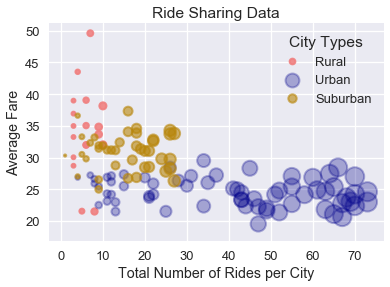
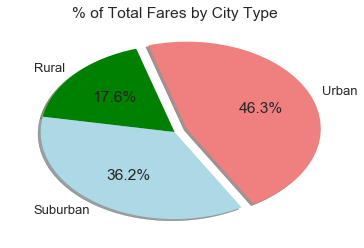
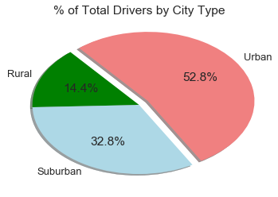
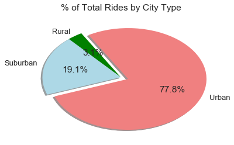

```python
import numpy as np
import pandas as pd
import matplotlib.pyplot as plt
import seaborn as sns
```


```python
#importing data
csv_path_c = "raw_data/ride_data.csv"
ride_df = pd.read_csv(csv_path_c)

csv_path_r = "raw_data/city_data.csv"
city_df = pd.read_csv(csv_path_r)
```


```python
merged_data = pd.merge(city_df, ride_df , on ="city")
```


```python
#Region type for city
city_types = city_df.set_index(["city"])["type"]
```


```python
#Region type for city
city_types = city_df.set_index(["city"])["type"]

#group by city
city_grouped = city_df.groupby('city')
ride_grouped = ride_df.groupby('city') 

#total number of Rides per city
tot_rides_city = city_grouped["driver_count"].sum()

#Average fare per city
fare_per_city = round(ride_grouped["fare"].mean(),2)

#new dataframe
city_chartists_df = pd.DataFrame({'Total Number of Rides':tot_rides_city, 'Average Fare':fare_per_city, 'Region': city_types})

#organize
city_chartists_df = city_chartists_df[["Total Number of Rides",'Average Fare','Region' ]]

#group by region 
rural_df = city_chartists_df[(city_chartists_df["Region"]=="Rural")]
urban_df = city_chartists_df[(city_chartists_df["Region"]=="Urban")]
suburban_df = city_chartists_df[(city_chartists_df["Region"]=="Suburban")]


```


```python
#formating
sns.set("talk")
sns.set_color_codes("dark")

#plot
rural_handle = plt.scatter(rural_df["Total Number of Rides"],rural_df["Average Fare"] , s=rural_df["Total Number of Rides"]*5, color = "lightcoral", alpha=0.9, label="Rural", linewidth=2)
urban_handle = plt.scatter(urban_df["Total Number of Rides"],urban_df["Average Fare"] , s=urban_df["Total Number of Rides"]*5, color = "darkblue", alpha=0.3, label="Urban", linewidth=2)
suburban_handle = plt.scatter(suburban_df["Total Number of Rides"],suburban_df["Average Fare"] , s=suburban_df["Total Number of Rides"]*5, color = "y", alpha=0.6, label="Suburban", linewidth=2)

#labels
plt.xlabel("Total Number of Rides per City")
plt.ylabel("Average Fare")
plt.title("Ride Sharing Data", loc="center")

#legend
plt.legend(handles=[rural_handle, urban_handle, suburban_handle ], loc="upper right", title="City Types")

#save plot
plt.show()
plt.savefig("RideSharingData.png")
```





```python
#Getting Driver Data
region_grouped = city_df.groupby("type") 
region_drivers = region_grouped["driver_count"].count()

#total drivers, fare, and rides per region

#Rural
rural_fare = rural_df["Average Fare"].sum()
rural_rides = rural_df["Total Number of Rides"].sum()
rural_drivers = region_drivers["Rural"]

#Urban
urban_fare = urban_df["Average Fare"].sum()
urban_rides = urban_df["Total Number of Rides"].sum()
urban_drivers = region_drivers["Urban"]

#Suburban
suburban_fare = suburban_df["Average Fare"].sum()
suburban_rides = suburban_df["Total Number of Rides"].sum()
suburban_drivers = region_drivers["Suburban"]
```


```python
#plot fare pie chart

#initialize
pies = ["Urban", "Rural", "Suburban"]
pie_votes = [urban_fare, rural_fare, suburban_fare]
colors = ["lightcoral","green","lightblue"]
explode = (.1,0,0)

#plot
plt.pie(pie_votes, explode=explode, labels=pies, colors=colors,
        autopct="%1.1f%%", shadow=True, startangle=-60)
plt.title("% of Total Fares by City Type", loc="center")


plt.show()
plt.savefig("FaresCityType.png")
```





```python
#plot fare pie chart

#initialize
pies = ["Urban", "Rural", "Suburban"]
pie_votes = [urban_drivers, rural_drivers, suburban_drivers]
colors = ["lightcoral","green","lightblue"]
explode = (.1,0,0)

#plot
plt.pie(pie_votes, explode=explode, labels=pies, colors=colors,
        autopct="%1.1f%%", shadow=True, startangle=-60)
plt.title("% of Total Drivers by City Type", loc="center")


plt.show()
plt.savefig("DriversCityType.png")
```





```python
#plot fare pie chart

#initialize
pies = ["Urban", "Rural", "Suburban"]
pie_votes = [urban_rides, rural_rides, suburban_rides]
colors = ["lightcoral","green","lightblue"]
explode = (.1,0,0)

#plot
plt.pie(pie_votes, explode=explode, labels=pies, colors=colors,
        autopct="%1.1f%%", shadow=True, startangle=-160)
plt.title("% of Total Rides by City Type", loc="center")

plt.show()
plt.savefig("RidesCityType.png")
```




