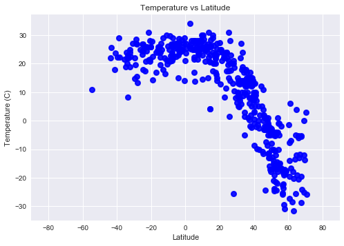
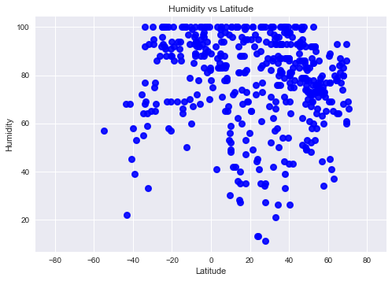
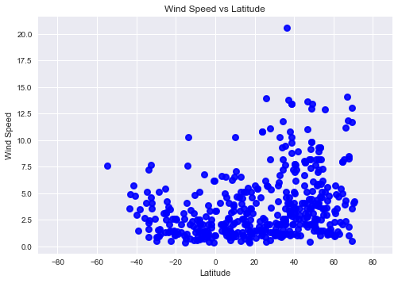
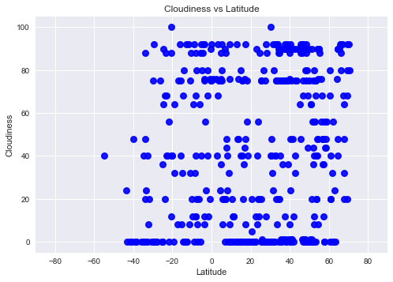

```python
#from config import api_key
from citipy import citipy
import random
import requests 
import pandas as pd
import numpy as np
import matplotlib.pyplot as plt
import matplotlib
import openweathermapy.core as ow
plt.style.use("seaborn")
```


```python
#all lon and lat in 20 point quadrants 
lat_quad = np.arange(-90,90,15)
long_quad = np.arange(-180,180,15)

#make data frame
city_df = pd.DataFrame()
city_df["Latitude"] = ""
city_df["Longitude"] = ""

for x in lat_quad:
    for y in long_quad:
        x_sector = list(np.arange(x,x+15,.01))
        lats = random.sample(x_sector,40)
        y_sector = list(np.arange(y,y+15,.01))
        longs = random.sample(y_sector,40)
        city_df = city_df.append(pd.DataFrame.from_dict({"Latitude":lats,"Longitude":longs }))
city_df = city_df.reset_index(drop=True)


```


```python
#use citipy to find cities
city_df["City name"] =""
city_df["Country code"]=""
for index,row in city_df.iterrows():
    city = citipy.nearest_city(row["Latitude"],row["Longitude"])
    city_df.set_value(index,"City name", city.city_name)
    city_df.set_value(index,"Country code", city.country_code)

```


```python
#get rid of longitude and latitude
cityname_df = city_df.drop(['Latitude','Longitude'],axis = 1)
cityname_df = cityname_df.drop_duplicates()
#get 500 sample cities
sample_cities = cityname_df.sample(500)
sample_cities = sample_cities.reset_index(drop=True)
```


```python
#Getting WeatherMap info
base_url = "http://api.openweathermap.org/data/2.5/weather"
app_id = "fa51096b3ebd6b49bfe3abd217f9bef4"
params = { "appid" :app_id,"units":"metric" }

for index,row in sample_cities.iterrows():
    params["q"] = f'{row["City name"]}'
    print(f"Retrieving weather information for {params['q']}")
    city_weather = requests.get(base_url,params)
    print(city_weather.url)
    city_weather  = city_weather.json()
    sample_cities.set_value(index,"Latitude",city_weather.get("coord",{}).get("lat"))
    sample_cities.set_value(index,"Longitude",city_weather.get("coord",{}).get("lon"))
    sample_cities.set_value(index,"Temperature",city_weather.get("main",{}).get("temp_max"))
    sample_cities.set_value(index,"Wind speed",city_weather.get("wind",{}).get("speed"))
    sample_cities.set_value(index,"Humidity",city_weather.get("main",{}).get("humidity"))
    sample_cities.set_value(index,"Cloudiness",city_weather.get("clouds",{}).get("all"))
```

    Retrieving weather information for tukrah
    http://api.openweathermap.org/data/2.5/weather?appid=fa51096b3ebd6b49bfe3abd217f9bef4&units=metric&q=tukrah
    Retrieving weather information for tokur
    http://api.openweathermap.org/data/2.5/weather?appid=fa51096b3ebd6b49bfe3abd217f9bef4&units=metric&q=tokur
    Retrieving weather information for tabuk
    http://api.openweathermap.org/data/2.5/weather?appid=fa51096b3ebd6b49bfe3abd217f9bef4&units=metric&q=tabuk
    Retrieving weather information for fort smith
    http://api.openweathermap.org/data/2.5/weather?appid=fa51096b3ebd6b49bfe3abd217f9bef4&units=metric&q=fort+smith
    Retrieving weather information for pontes e lacerda
    http://api.openweathermap.org/data/2.5/weather?appid=fa51096b3ebd6b49bfe3abd217f9bef4&units=metric&q=pontes+e+lacerda
    Retrieving weather information for mount isa
    http://api.openweathermap.org/data/2.5/weather?appid=fa51096b3ebd6b49bfe3abd217f9bef4&units=metric&q=mount+isa
    Retrieving weather information for simpang
    http://api.openweathermap.org/data/2.5/weather?appid=fa51096b3ebd6b49bfe3abd217f9bef4&units=metric&q=simpang
    Retrieving weather information for aripuana
    http://api.openweathermap.org/data/2.5/weather?appid=fa51096b3ebd6b49bfe3abd217f9bef4&units=metric&q=aripuana
    Retrieving weather information for eydhafushi
    http://api.openweathermap.org/data/2.5/weather?appid=fa51096b3ebd6b49bfe3abd217f9bef4&units=metric&q=eydhafushi
    Retrieving weather information for luba
    http://api.openweathermap.org/data/2.5/weather?appid=fa51096b3ebd6b49bfe3abd217f9bef4&units=metric&q=luba
    Retrieving weather information for saint-pierre
    http://api.openweathermap.org/data/2.5/weather?appid=fa51096b3ebd6b49bfe3abd217f9bef4&units=metric&q=saint-pierre
    Retrieving weather information for sadiqabad
    http://api.openweathermap.org/data/2.5/weather?appid=fa51096b3ebd6b49bfe3abd217f9bef4&units=metric&q=sadiqabad
    Retrieving weather information for san luis
    http://api.openweathermap.org/data/2.5/weather?appid=fa51096b3ebd6b49bfe3abd217f9bef4&units=metric&q=san+luis
    Retrieving weather information for conceicao do mato dentro
    http://api.openweathermap.org/data/2.5/weather?appid=fa51096b3ebd6b49bfe3abd217f9bef4&units=metric&q=conceicao+do+mato+dentro
    Retrieving weather information for yabelo
    http://api.openweathermap.org/data/2.5/weather?appid=fa51096b3ebd6b49bfe3abd217f9bef4&units=metric&q=yabelo
    Retrieving weather information for konolfingen
    http://api.openweathermap.org/data/2.5/weather?appid=fa51096b3ebd6b49bfe3abd217f9bef4&units=metric&q=konolfingen
    Retrieving weather information for mahenge
    http://api.openweathermap.org/data/2.5/weather?appid=fa51096b3ebd6b49bfe3abd217f9bef4&units=metric&q=mahenge
    Retrieving weather information for sawakin
    http://api.openweathermap.org/data/2.5/weather?appid=fa51096b3ebd6b49bfe3abd217f9bef4&units=metric&q=sawakin
    Retrieving weather information for ixtapa
    http://api.openweathermap.org/data/2.5/weather?appid=fa51096b3ebd6b49bfe3abd217f9bef4&units=metric&q=ixtapa
    Retrieving weather information for buenos aires
    http://api.openweathermap.org/data/2.5/weather?appid=fa51096b3ebd6b49bfe3abd217f9bef4&units=metric&q=buenos+aires
    Retrieving weather information for vibo valentia
    http://api.openweathermap.org/data/2.5/weather?appid=fa51096b3ebd6b49bfe3abd217f9bef4&units=metric&q=vibo+valentia
    Retrieving weather information for chaohu
    http://api.openweathermap.org/data/2.5/weather?appid=fa51096b3ebd6b49bfe3abd217f9bef4&units=metric&q=chaohu
    Retrieving weather information for changping
    http://api.openweathermap.org/data/2.5/weather?appid=fa51096b3ebd6b49bfe3abd217f9bef4&units=metric&q=changping
    Retrieving weather information for ushuaia
    http://api.openweathermap.org/data/2.5/weather?appid=fa51096b3ebd6b49bfe3abd217f9bef4&units=metric&q=ushuaia
    Retrieving weather information for port hedland
    http://api.openweathermap.org/data/2.5/weather?appid=fa51096b3ebd6b49bfe3abd217f9bef4&units=metric&q=port+hedland
    Retrieving weather information for cockburn town
    http://api.openweathermap.org/data/2.5/weather?appid=fa51096b3ebd6b49bfe3abd217f9bef4&units=metric&q=cockburn+town
    Retrieving weather information for navalmoral de la mata
    http://api.openweathermap.org/data/2.5/weather?appid=fa51096b3ebd6b49bfe3abd217f9bef4&units=metric&q=navalmoral+de+la+mata
    Retrieving weather information for radhanpur
    http://api.openweathermap.org/data/2.5/weather?appid=fa51096b3ebd6b49bfe3abd217f9bef4&units=metric&q=radhanpur
    Retrieving weather information for gumdag
    http://api.openweathermap.org/data/2.5/weather?appid=fa51096b3ebd6b49bfe3abd217f9bef4&units=metric&q=gumdag
    Retrieving weather information for zhaoyuan
    http://api.openweathermap.org/data/2.5/weather?appid=fa51096b3ebd6b49bfe3abd217f9bef4&units=metric&q=zhaoyuan
    Retrieving weather information for chokurdakh
    http://api.openweathermap.org/data/2.5/weather?appid=fa51096b3ebd6b49bfe3abd217f9bef4&units=metric&q=chokurdakh
    Retrieving weather information for ilulissat
    http://api.openweathermap.org/data/2.5/weather?appid=fa51096b3ebd6b49bfe3abd217f9bef4&units=metric&q=ilulissat
    Retrieving weather information for contamana
    http://api.openweathermap.org/data/2.5/weather?appid=fa51096b3ebd6b49bfe3abd217f9bef4&units=metric&q=contamana
    Retrieving weather information for viedma
    http://api.openweathermap.org/data/2.5/weather?appid=fa51096b3ebd6b49bfe3abd217f9bef4&units=metric&q=viedma
    Retrieving weather information for kalangala
    http://api.openweathermap.org/data/2.5/weather?appid=fa51096b3ebd6b49bfe3abd217f9bef4&units=metric&q=kalangala
    Retrieving weather information for novokruchininskiy
    http://api.openweathermap.org/data/2.5/weather?appid=fa51096b3ebd6b49bfe3abd217f9bef4&units=metric&q=novokruchininskiy
    Retrieving weather information for santiago de cao
    http://api.openweathermap.org/data/2.5/weather?appid=fa51096b3ebd6b49bfe3abd217f9bef4&units=metric&q=santiago+de+cao
    Retrieving weather information for hay river
    http://api.openweathermap.org/data/2.5/weather?appid=fa51096b3ebd6b49bfe3abd217f9bef4&units=metric&q=hay+river
    Retrieving weather information for rudnogorsk
    http://api.openweathermap.org/data/2.5/weather?appid=fa51096b3ebd6b49bfe3abd217f9bef4&units=metric&q=rudnogorsk
    Retrieving weather information for sokoni
    http://api.openweathermap.org/data/2.5/weather?appid=fa51096b3ebd6b49bfe3abd217f9bef4&units=metric&q=sokoni
    Retrieving weather information for tongren
    http://api.openweathermap.org/data/2.5/weather?appid=fa51096b3ebd6b49bfe3abd217f9bef4&units=metric&q=tongren
    Retrieving weather information for oakdale
    http://api.openweathermap.org/data/2.5/weather?appid=fa51096b3ebd6b49bfe3abd217f9bef4&units=metric&q=oakdale
    Retrieving weather information for enshi
    http://api.openweathermap.org/data/2.5/weather?appid=fa51096b3ebd6b49bfe3abd217f9bef4&units=metric&q=enshi
    Retrieving weather information for yakeshi
    http://api.openweathermap.org/data/2.5/weather?appid=fa51096b3ebd6b49bfe3abd217f9bef4&units=metric&q=yakeshi
    Retrieving weather information for umm kaddadah
    http://api.openweathermap.org/data/2.5/weather?appid=fa51096b3ebd6b49bfe3abd217f9bef4&units=metric&q=umm+kaddadah
    Retrieving weather information for gambiran
    http://api.openweathermap.org/data/2.5/weather?appid=fa51096b3ebd6b49bfe3abd217f9bef4&units=metric&q=gambiran
    Retrieving weather information for itaueira
    http://api.openweathermap.org/data/2.5/weather?appid=fa51096b3ebd6b49bfe3abd217f9bef4&units=metric&q=itaueira
    Retrieving weather information for west bay
    http://api.openweathermap.org/data/2.5/weather?appid=fa51096b3ebd6b49bfe3abd217f9bef4&units=metric&q=west+bay
    Retrieving weather information for mastic beach
    http://api.openweathermap.org/data/2.5/weather?appid=fa51096b3ebd6b49bfe3abd217f9bef4&units=metric&q=mastic+beach
    Retrieving weather information for muncar
    http://api.openweathermap.org/data/2.5/weather?appid=fa51096b3ebd6b49bfe3abd217f9bef4&units=metric&q=muncar
    Retrieving weather information for mansa
    http://api.openweathermap.org/data/2.5/weather?appid=fa51096b3ebd6b49bfe3abd217f9bef4&units=metric&q=mansa
    Retrieving weather information for najran
    http://api.openweathermap.org/data/2.5/weather?appid=fa51096b3ebd6b49bfe3abd217f9bef4&units=metric&q=najran
    Retrieving weather information for micheweni
    http://api.openweathermap.org/data/2.5/weather?appid=fa51096b3ebd6b49bfe3abd217f9bef4&units=metric&q=micheweni
    Retrieving weather information for shirgaon
    http://api.openweathermap.org/data/2.5/weather?appid=fa51096b3ebd6b49bfe3abd217f9bef4&units=metric&q=shirgaon
    Retrieving weather information for leningradskiy
    http://api.openweathermap.org/data/2.5/weather?appid=fa51096b3ebd6b49bfe3abd217f9bef4&units=metric&q=leningradskiy
    Retrieving weather information for shelburne
    http://api.openweathermap.org/data/2.5/weather?appid=fa51096b3ebd6b49bfe3abd217f9bef4&units=metric&q=shelburne
    Retrieving weather information for puerto narino
    http://api.openweathermap.org/data/2.5/weather?appid=fa51096b3ebd6b49bfe3abd217f9bef4&units=metric&q=puerto+narino
    Retrieving weather information for moyeuvre-grande
    http://api.openweathermap.org/data/2.5/weather?appid=fa51096b3ebd6b49bfe3abd217f9bef4&units=metric&q=moyeuvre-grande
    Retrieving weather information for grand centre
    http://api.openweathermap.org/data/2.5/weather?appid=fa51096b3ebd6b49bfe3abd217f9bef4&units=metric&q=grand+centre
    Retrieving weather information for isangel
    http://api.openweathermap.org/data/2.5/weather?appid=fa51096b3ebd6b49bfe3abd217f9bef4&units=metric&q=isangel
    Retrieving weather information for si bun ruang
    http://api.openweathermap.org/data/2.5/weather?appid=fa51096b3ebd6b49bfe3abd217f9bef4&units=metric&q=si+bun+ruang
    Retrieving weather information for gasa
    http://api.openweathermap.org/data/2.5/weather?appid=fa51096b3ebd6b49bfe3abd217f9bef4&units=metric&q=gasa
    Retrieving weather information for kruisfontein
    http://api.openweathermap.org/data/2.5/weather?appid=fa51096b3ebd6b49bfe3abd217f9bef4&units=metric&q=kruisfontein
    Retrieving weather information for kirakira
    http://api.openweathermap.org/data/2.5/weather?appid=fa51096b3ebd6b49bfe3abd217f9bef4&units=metric&q=kirakira
    Retrieving weather information for bababe
    http://api.openweathermap.org/data/2.5/weather?appid=fa51096b3ebd6b49bfe3abd217f9bef4&units=metric&q=bababe
    Retrieving weather information for guilin
    http://api.openweathermap.org/data/2.5/weather?appid=fa51096b3ebd6b49bfe3abd217f9bef4&units=metric&q=guilin
    Retrieving weather information for turbat
    http://api.openweathermap.org/data/2.5/weather?appid=fa51096b3ebd6b49bfe3abd217f9bef4&units=metric&q=turbat
    Retrieving weather information for gigmoto
    http://api.openweathermap.org/data/2.5/weather?appid=fa51096b3ebd6b49bfe3abd217f9bef4&units=metric&q=gigmoto
    Retrieving weather information for obihiro
    http://api.openweathermap.org/data/2.5/weather?appid=fa51096b3ebd6b49bfe3abd217f9bef4&units=metric&q=obihiro
    Retrieving weather information for namie
    http://api.openweathermap.org/data/2.5/weather?appid=fa51096b3ebd6b49bfe3abd217f9bef4&units=metric&q=namie
    Retrieving weather information for cabo san lucas
    http://api.openweathermap.org/data/2.5/weather?appid=fa51096b3ebd6b49bfe3abd217f9bef4&units=metric&q=cabo+san+lucas
    Retrieving weather information for xam nua
    http://api.openweathermap.org/data/2.5/weather?appid=fa51096b3ebd6b49bfe3abd217f9bef4&units=metric&q=xam+nua
    Retrieving weather information for afmadu
    http://api.openweathermap.org/data/2.5/weather?appid=fa51096b3ebd6b49bfe3abd217f9bef4&units=metric&q=afmadu
    Retrieving weather information for orlovskiy
    http://api.openweathermap.org/data/2.5/weather?appid=fa51096b3ebd6b49bfe3abd217f9bef4&units=metric&q=orlovskiy
    Retrieving weather information for borgarnes
    http://api.openweathermap.org/data/2.5/weather?appid=fa51096b3ebd6b49bfe3abd217f9bef4&units=metric&q=borgarnes
    Retrieving weather information for kropotkin
    http://api.openweathermap.org/data/2.5/weather?appid=fa51096b3ebd6b49bfe3abd217f9bef4&units=metric&q=kropotkin
    Retrieving weather information for beidao
    http://api.openweathermap.org/data/2.5/weather?appid=fa51096b3ebd6b49bfe3abd217f9bef4&units=metric&q=beidao
    Retrieving weather information for yatou
    http://api.openweathermap.org/data/2.5/weather?appid=fa51096b3ebd6b49bfe3abd217f9bef4&units=metric&q=yatou
    Retrieving weather information for preston
    http://api.openweathermap.org/data/2.5/weather?appid=fa51096b3ebd6b49bfe3abd217f9bef4&units=metric&q=preston
    Retrieving weather information for koungou
    http://api.openweathermap.org/data/2.5/weather?appid=fa51096b3ebd6b49bfe3abd217f9bef4&units=metric&q=koungou
    Retrieving weather information for onega
    http://api.openweathermap.org/data/2.5/weather?appid=fa51096b3ebd6b49bfe3abd217f9bef4&units=metric&q=onega
    Retrieving weather information for saint-philippe
    http://api.openweathermap.org/data/2.5/weather?appid=fa51096b3ebd6b49bfe3abd217f9bef4&units=metric&q=saint-philippe
    Retrieving weather information for birjand
    http://api.openweathermap.org/data/2.5/weather?appid=fa51096b3ebd6b49bfe3abd217f9bef4&units=metric&q=birjand
    Retrieving weather information for kemijarvi
    http://api.openweathermap.org/data/2.5/weather?appid=fa51096b3ebd6b49bfe3abd217f9bef4&units=metric&q=kemijarvi
    Retrieving weather information for oksfjord
    http://api.openweathermap.org/data/2.5/weather?appid=fa51096b3ebd6b49bfe3abd217f9bef4&units=metric&q=oksfjord
    Retrieving weather information for nicoya
    http://api.openweathermap.org/data/2.5/weather?appid=fa51096b3ebd6b49bfe3abd217f9bef4&units=metric&q=nicoya
    Retrieving weather information for pringsewu
    http://api.openweathermap.org/data/2.5/weather?appid=fa51096b3ebd6b49bfe3abd217f9bef4&units=metric&q=pringsewu
    Retrieving weather information for phan thiet
    http://api.openweathermap.org/data/2.5/weather?appid=fa51096b3ebd6b49bfe3abd217f9bef4&units=metric&q=phan+thiet
    Retrieving weather information for srandakan
    http://api.openweathermap.org/data/2.5/weather?appid=fa51096b3ebd6b49bfe3abd217f9bef4&units=metric&q=srandakan
    Retrieving weather information for prince george
    http://api.openweathermap.org/data/2.5/weather?appid=fa51096b3ebd6b49bfe3abd217f9bef4&units=metric&q=prince+george
    Retrieving weather information for shahrud
    http://api.openweathermap.org/data/2.5/weather?appid=fa51096b3ebd6b49bfe3abd217f9bef4&units=metric&q=shahrud
    Retrieving weather information for atkarsk
    http://api.openweathermap.org/data/2.5/weather?appid=fa51096b3ebd6b49bfe3abd217f9bef4&units=metric&q=atkarsk
    Retrieving weather information for antsohihy
    http://api.openweathermap.org/data/2.5/weather?appid=fa51096b3ebd6b49bfe3abd217f9bef4&units=metric&q=antsohihy
    Retrieving weather information for mogoytuy
    http://api.openweathermap.org/data/2.5/weather?appid=fa51096b3ebd6b49bfe3abd217f9bef4&units=metric&q=mogoytuy
    Retrieving weather information for ada
    http://api.openweathermap.org/data/2.5/weather?appid=fa51096b3ebd6b49bfe3abd217f9bef4&units=metric&q=ada
    Retrieving weather information for sataua
    http://api.openweathermap.org/data/2.5/weather?appid=fa51096b3ebd6b49bfe3abd217f9bef4&units=metric&q=sataua
    Retrieving weather information for pocoes
    http://api.openweathermap.org/data/2.5/weather?appid=fa51096b3ebd6b49bfe3abd217f9bef4&units=metric&q=pocoes
    Retrieving weather information for sitrah
    http://api.openweathermap.org/data/2.5/weather?appid=fa51096b3ebd6b49bfe3abd217f9bef4&units=metric&q=sitrah
    Retrieving weather information for yumen
    http://api.openweathermap.org/data/2.5/weather?appid=fa51096b3ebd6b49bfe3abd217f9bef4&units=metric&q=yumen
    Retrieving weather information for severodvinsk
    http://api.openweathermap.org/data/2.5/weather?appid=fa51096b3ebd6b49bfe3abd217f9bef4&units=metric&q=severodvinsk
    Retrieving weather information for dawei
    http://api.openweathermap.org/data/2.5/weather?appid=fa51096b3ebd6b49bfe3abd217f9bef4&units=metric&q=dawei
    Retrieving weather information for nabire
    http://api.openweathermap.org/data/2.5/weather?appid=fa51096b3ebd6b49bfe3abd217f9bef4&units=metric&q=nabire
    Retrieving weather information for mineros
    http://api.openweathermap.org/data/2.5/weather?appid=fa51096b3ebd6b49bfe3abd217f9bef4&units=metric&q=mineros
    Retrieving weather information for puksoozero
    http://api.openweathermap.org/data/2.5/weather?appid=fa51096b3ebd6b49bfe3abd217f9bef4&units=metric&q=puksoozero
    Retrieving weather information for mirabad
    http://api.openweathermap.org/data/2.5/weather?appid=fa51096b3ebd6b49bfe3abd217f9bef4&units=metric&q=mirabad
    Retrieving weather information for sovetskiy
    http://api.openweathermap.org/data/2.5/weather?appid=fa51096b3ebd6b49bfe3abd217f9bef4&units=metric&q=sovetskiy
    Retrieving weather information for sur
    http://api.openweathermap.org/data/2.5/weather?appid=fa51096b3ebd6b49bfe3abd217f9bef4&units=metric&q=sur
    Retrieving weather information for boa vista
    http://api.openweathermap.org/data/2.5/weather?appid=fa51096b3ebd6b49bfe3abd217f9bef4&units=metric&q=boa+vista
    Retrieving weather information for adrar
    http://api.openweathermap.org/data/2.5/weather?appid=fa51096b3ebd6b49bfe3abd217f9bef4&units=metric&q=adrar
    Retrieving weather information for clarence town
    http://api.openweathermap.org/data/2.5/weather?appid=fa51096b3ebd6b49bfe3abd217f9bef4&units=metric&q=clarence+town
    Retrieving weather information for baruun-urt
    http://api.openweathermap.org/data/2.5/weather?appid=fa51096b3ebd6b49bfe3abd217f9bef4&units=metric&q=baruun-urt
    Retrieving weather information for galiwinku
    http://api.openweathermap.org/data/2.5/weather?appid=fa51096b3ebd6b49bfe3abd217f9bef4&units=metric&q=galiwinku
    Retrieving weather information for beaufort
    http://api.openweathermap.org/data/2.5/weather?appid=fa51096b3ebd6b49bfe3abd217f9bef4&units=metric&q=beaufort
    Retrieving weather information for alur
    http://api.openweathermap.org/data/2.5/weather?appid=fa51096b3ebd6b49bfe3abd217f9bef4&units=metric&q=alur
    Retrieving weather information for kayerkan
    http://api.openweathermap.org/data/2.5/weather?appid=fa51096b3ebd6b49bfe3abd217f9bef4&units=metric&q=kayerkan
    Retrieving weather information for mayumba
    http://api.openweathermap.org/data/2.5/weather?appid=fa51096b3ebd6b49bfe3abd217f9bef4&units=metric&q=mayumba
    Retrieving weather information for baghdad
    http://api.openweathermap.org/data/2.5/weather?appid=fa51096b3ebd6b49bfe3abd217f9bef4&units=metric&q=baghdad
    Retrieving weather information for midland
    http://api.openweathermap.org/data/2.5/weather?appid=fa51096b3ebd6b49bfe3abd217f9bef4&units=metric&q=midland
    Retrieving weather information for hof
    http://api.openweathermap.org/data/2.5/weather?appid=fa51096b3ebd6b49bfe3abd217f9bef4&units=metric&q=hof
    Retrieving weather information for teeli
    http://api.openweathermap.org/data/2.5/weather?appid=fa51096b3ebd6b49bfe3abd217f9bef4&units=metric&q=teeli
    Retrieving weather information for yalta
    http://api.openweathermap.org/data/2.5/weather?appid=fa51096b3ebd6b49bfe3abd217f9bef4&units=metric&q=yalta
    Retrieving weather information for yashkino
    http://api.openweathermap.org/data/2.5/weather?appid=fa51096b3ebd6b49bfe3abd217f9bef4&units=metric&q=yashkino
    Retrieving weather information for lieksa
    http://api.openweathermap.org/data/2.5/weather?appid=fa51096b3ebd6b49bfe3abd217f9bef4&units=metric&q=lieksa
    Retrieving weather information for livezi
    http://api.openweathermap.org/data/2.5/weather?appid=fa51096b3ebd6b49bfe3abd217f9bef4&units=metric&q=livezi
    Retrieving weather information for harvard
    http://api.openweathermap.org/data/2.5/weather?appid=fa51096b3ebd6b49bfe3abd217f9bef4&units=metric&q=harvard
    Retrieving weather information for sydney
    http://api.openweathermap.org/data/2.5/weather?appid=fa51096b3ebd6b49bfe3abd217f9bef4&units=metric&q=sydney
    Retrieving weather information for lexington
    http://api.openweathermap.org/data/2.5/weather?appid=fa51096b3ebd6b49bfe3abd217f9bef4&units=metric&q=lexington
    Retrieving weather information for egvekinot
    http://api.openweathermap.org/data/2.5/weather?appid=fa51096b3ebd6b49bfe3abd217f9bef4&units=metric&q=egvekinot
    Retrieving weather information for naica
    http://api.openweathermap.org/data/2.5/weather?appid=fa51096b3ebd6b49bfe3abd217f9bef4&units=metric&q=naica
    Retrieving weather information for domna
    http://api.openweathermap.org/data/2.5/weather?appid=fa51096b3ebd6b49bfe3abd217f9bef4&units=metric&q=domna
    Retrieving weather information for naryan-mar
    http://api.openweathermap.org/data/2.5/weather?appid=fa51096b3ebd6b49bfe3abd217f9bef4&units=metric&q=naryan-mar
    Retrieving weather information for nemencine
    http://api.openweathermap.org/data/2.5/weather?appid=fa51096b3ebd6b49bfe3abd217f9bef4&units=metric&q=nemencine
    Retrieving weather information for travesia
    http://api.openweathermap.org/data/2.5/weather?appid=fa51096b3ebd6b49bfe3abd217f9bef4&units=metric&q=travesia
    Retrieving weather information for thilogne
    http://api.openweathermap.org/data/2.5/weather?appid=fa51096b3ebd6b49bfe3abd217f9bef4&units=metric&q=thilogne
    Retrieving weather information for vallenar
    http://api.openweathermap.org/data/2.5/weather?appid=fa51096b3ebd6b49bfe3abd217f9bef4&units=metric&q=vallenar
    Retrieving weather information for norman wells
    http://api.openweathermap.org/data/2.5/weather?appid=fa51096b3ebd6b49bfe3abd217f9bef4&units=metric&q=norman+wells
    Retrieving weather information for beroroha
    http://api.openweathermap.org/data/2.5/weather?appid=fa51096b3ebd6b49bfe3abd217f9bef4&units=metric&q=beroroha
    Retrieving weather information for dareda
    http://api.openweathermap.org/data/2.5/weather?appid=fa51096b3ebd6b49bfe3abd217f9bef4&units=metric&q=dareda
    Retrieving weather information for vulcan
    http://api.openweathermap.org/data/2.5/weather?appid=fa51096b3ebd6b49bfe3abd217f9bef4&units=metric&q=vulcan
    Retrieving weather information for arcachon
    http://api.openweathermap.org/data/2.5/weather?appid=fa51096b3ebd6b49bfe3abd217f9bef4&units=metric&q=arcachon
    Retrieving weather information for banjar
    http://api.openweathermap.org/data/2.5/weather?appid=fa51096b3ebd6b49bfe3abd217f9bef4&units=metric&q=banjar
    Retrieving weather information for novyy nekouz
    http://api.openweathermap.org/data/2.5/weather?appid=fa51096b3ebd6b49bfe3abd217f9bef4&units=metric&q=novyy+nekouz
    Retrieving weather information for dubrovnik
    http://api.openweathermap.org/data/2.5/weather?appid=fa51096b3ebd6b49bfe3abd217f9bef4&units=metric&q=dubrovnik
    Retrieving weather information for georgetown
    http://api.openweathermap.org/data/2.5/weather?appid=fa51096b3ebd6b49bfe3abd217f9bef4&units=metric&q=georgetown
    Retrieving weather information for huarmey
    http://api.openweathermap.org/data/2.5/weather?appid=fa51096b3ebd6b49bfe3abd217f9bef4&units=metric&q=huarmey
    Retrieving weather information for geilo
    http://api.openweathermap.org/data/2.5/weather?appid=fa51096b3ebd6b49bfe3abd217f9bef4&units=metric&q=geilo
    Retrieving weather information for savannah bight
    http://api.openweathermap.org/data/2.5/weather?appid=fa51096b3ebd6b49bfe3abd217f9bef4&units=metric&q=savannah+bight
    Retrieving weather information for dali
    http://api.openweathermap.org/data/2.5/weather?appid=fa51096b3ebd6b49bfe3abd217f9bef4&units=metric&q=dali
    Retrieving weather information for netivot
    http://api.openweathermap.org/data/2.5/weather?appid=fa51096b3ebd6b49bfe3abd217f9bef4&units=metric&q=netivot
    Retrieving weather information for biltine
    http://api.openweathermap.org/data/2.5/weather?appid=fa51096b3ebd6b49bfe3abd217f9bef4&units=metric&q=biltine
    Retrieving weather information for sechura
    http://api.openweathermap.org/data/2.5/weather?appid=fa51096b3ebd6b49bfe3abd217f9bef4&units=metric&q=sechura
    Retrieving weather information for christchurch
    http://api.openweathermap.org/data/2.5/weather?appid=fa51096b3ebd6b49bfe3abd217f9bef4&units=metric&q=christchurch
    Retrieving weather information for caborca
    http://api.openweathermap.org/data/2.5/weather?appid=fa51096b3ebd6b49bfe3abd217f9bef4&units=metric&q=caborca
    Retrieving weather information for quatre cocos
    http://api.openweathermap.org/data/2.5/weather?appid=fa51096b3ebd6b49bfe3abd217f9bef4&units=metric&q=quatre+cocos
    Retrieving weather information for numan
    http://api.openweathermap.org/data/2.5/weather?appid=fa51096b3ebd6b49bfe3abd217f9bef4&units=metric&q=numan
    Retrieving weather information for shingu
    http://api.openweathermap.org/data/2.5/weather?appid=fa51096b3ebd6b49bfe3abd217f9bef4&units=metric&q=shingu
    Retrieving weather information for smithers
    http://api.openweathermap.org/data/2.5/weather?appid=fa51096b3ebd6b49bfe3abd217f9bef4&units=metric&q=smithers
    Retrieving weather information for rio grande
    http://api.openweathermap.org/data/2.5/weather?appid=fa51096b3ebd6b49bfe3abd217f9bef4&units=metric&q=rio+grande
    Retrieving weather information for gubkinskiy
    http://api.openweathermap.org/data/2.5/weather?appid=fa51096b3ebd6b49bfe3abd217f9bef4&units=metric&q=gubkinskiy
    Retrieving weather information for kadykchan
    http://api.openweathermap.org/data/2.5/weather?appid=fa51096b3ebd6b49bfe3abd217f9bef4&units=metric&q=kadykchan
    Retrieving weather information for itupiranga
    http://api.openweathermap.org/data/2.5/weather?appid=fa51096b3ebd6b49bfe3abd217f9bef4&units=metric&q=itupiranga
    Retrieving weather information for aden
    http://api.openweathermap.org/data/2.5/weather?appid=fa51096b3ebd6b49bfe3abd217f9bef4&units=metric&q=aden
    Retrieving weather information for ilebo
    http://api.openweathermap.org/data/2.5/weather?appid=fa51096b3ebd6b49bfe3abd217f9bef4&units=metric&q=ilebo
    Retrieving weather information for kirac
    http://api.openweathermap.org/data/2.5/weather?appid=fa51096b3ebd6b49bfe3abd217f9bef4&units=metric&q=kirac
    Retrieving weather information for pedernales
    http://api.openweathermap.org/data/2.5/weather?appid=fa51096b3ebd6b49bfe3abd217f9bef4&units=metric&q=pedernales
    Retrieving weather information for taiyuan
    http://api.openweathermap.org/data/2.5/weather?appid=fa51096b3ebd6b49bfe3abd217f9bef4&units=metric&q=taiyuan
    Retrieving weather information for zabid
    http://api.openweathermap.org/data/2.5/weather?appid=fa51096b3ebd6b49bfe3abd217f9bef4&units=metric&q=zabid
    Retrieving weather information for ubinskoye
    http://api.openweathermap.org/data/2.5/weather?appid=fa51096b3ebd6b49bfe3abd217f9bef4&units=metric&q=ubinskoye
    Retrieving weather information for mandurah
    http://api.openweathermap.org/data/2.5/weather?appid=fa51096b3ebd6b49bfe3abd217f9bef4&units=metric&q=mandurah
    Retrieving weather information for hami
    http://api.openweathermap.org/data/2.5/weather?appid=fa51096b3ebd6b49bfe3abd217f9bef4&units=metric&q=hami
    Retrieving weather information for namatanai
    http://api.openweathermap.org/data/2.5/weather?appid=fa51096b3ebd6b49bfe3abd217f9bef4&units=metric&q=namatanai
    Retrieving weather information for jhang
    http://api.openweathermap.org/data/2.5/weather?appid=fa51096b3ebd6b49bfe3abd217f9bef4&units=metric&q=jhang
    Retrieving weather information for andenes
    http://api.openweathermap.org/data/2.5/weather?appid=fa51096b3ebd6b49bfe3abd217f9bef4&units=metric&q=andenes
    Retrieving weather information for souris
    http://api.openweathermap.org/data/2.5/weather?appid=fa51096b3ebd6b49bfe3abd217f9bef4&units=metric&q=souris
    Retrieving weather information for rio hato
    http://api.openweathermap.org/data/2.5/weather?appid=fa51096b3ebd6b49bfe3abd217f9bef4&units=metric&q=rio+hato
    Retrieving weather information for xiuyan
    http://api.openweathermap.org/data/2.5/weather?appid=fa51096b3ebd6b49bfe3abd217f9bef4&units=metric&q=xiuyan
    Retrieving weather information for asheboro
    http://api.openweathermap.org/data/2.5/weather?appid=fa51096b3ebd6b49bfe3abd217f9bef4&units=metric&q=asheboro
    Retrieving weather information for yabassi
    http://api.openweathermap.org/data/2.5/weather?appid=fa51096b3ebd6b49bfe3abd217f9bef4&units=metric&q=yabassi
    Retrieving weather information for balkhash
    http://api.openweathermap.org/data/2.5/weather?appid=fa51096b3ebd6b49bfe3abd217f9bef4&units=metric&q=balkhash
    Retrieving weather information for mahebourg
    http://api.openweathermap.org/data/2.5/weather?appid=fa51096b3ebd6b49bfe3abd217f9bef4&units=metric&q=mahebourg
    Retrieving weather information for chengdu
    http://api.openweathermap.org/data/2.5/weather?appid=fa51096b3ebd6b49bfe3abd217f9bef4&units=metric&q=chengdu
    Retrieving weather information for antigonish
    http://api.openweathermap.org/data/2.5/weather?appid=fa51096b3ebd6b49bfe3abd217f9bef4&units=metric&q=antigonish
    Retrieving weather information for iguape
    http://api.openweathermap.org/data/2.5/weather?appid=fa51096b3ebd6b49bfe3abd217f9bef4&units=metric&q=iguape
    Retrieving weather information for edendale
    http://api.openweathermap.org/data/2.5/weather?appid=fa51096b3ebd6b49bfe3abd217f9bef4&units=metric&q=edendale
    Retrieving weather information for boralday
    http://api.openweathermap.org/data/2.5/weather?appid=fa51096b3ebd6b49bfe3abd217f9bef4&units=metric&q=boralday
    Retrieving weather information for shiyan
    http://api.openweathermap.org/data/2.5/weather?appid=fa51096b3ebd6b49bfe3abd217f9bef4&units=metric&q=shiyan
    Retrieving weather information for sokolo
    http://api.openweathermap.org/data/2.5/weather?appid=fa51096b3ebd6b49bfe3abd217f9bef4&units=metric&q=sokolo
    Retrieving weather information for farafangana
    http://api.openweathermap.org/data/2.5/weather?appid=fa51096b3ebd6b49bfe3abd217f9bef4&units=metric&q=farafangana
    Retrieving weather information for saint-jean-de-maurienne
    http://api.openweathermap.org/data/2.5/weather?appid=fa51096b3ebd6b49bfe3abd217f9bef4&units=metric&q=saint-jean-de-maurienne
    Retrieving weather information for hualmay
    http://api.openweathermap.org/data/2.5/weather?appid=fa51096b3ebd6b49bfe3abd217f9bef4&units=metric&q=hualmay
    Retrieving weather information for ginda
    http://api.openweathermap.org/data/2.5/weather?appid=fa51096b3ebd6b49bfe3abd217f9bef4&units=metric&q=ginda
    Retrieving weather information for tawkar
    http://api.openweathermap.org/data/2.5/weather?appid=fa51096b3ebd6b49bfe3abd217f9bef4&units=metric&q=tawkar
    Retrieving weather information for segou
    http://api.openweathermap.org/data/2.5/weather?appid=fa51096b3ebd6b49bfe3abd217f9bef4&units=metric&q=segou
    Retrieving weather information for butaritari
    http://api.openweathermap.org/data/2.5/weather?appid=fa51096b3ebd6b49bfe3abd217f9bef4&units=metric&q=butaritari
    Retrieving weather information for plouzane
    http://api.openweathermap.org/data/2.5/weather?appid=fa51096b3ebd6b49bfe3abd217f9bef4&units=metric&q=plouzane
    Retrieving weather information for pailitas
    http://api.openweathermap.org/data/2.5/weather?appid=fa51096b3ebd6b49bfe3abd217f9bef4&units=metric&q=pailitas
    Retrieving weather information for rio claro
    http://api.openweathermap.org/data/2.5/weather?appid=fa51096b3ebd6b49bfe3abd217f9bef4&units=metric&q=rio+claro
    Retrieving weather information for bolobo
    http://api.openweathermap.org/data/2.5/weather?appid=fa51096b3ebd6b49bfe3abd217f9bef4&units=metric&q=bolobo
    Retrieving weather information for kralendijk
    http://api.openweathermap.org/data/2.5/weather?appid=fa51096b3ebd6b49bfe3abd217f9bef4&units=metric&q=kralendijk
    Retrieving weather information for camopi
    http://api.openweathermap.org/data/2.5/weather?appid=fa51096b3ebd6b49bfe3abd217f9bef4&units=metric&q=camopi
    Retrieving weather information for santa maria
    http://api.openweathermap.org/data/2.5/weather?appid=fa51096b3ebd6b49bfe3abd217f9bef4&units=metric&q=santa+maria
    Retrieving weather information for barranca
    http://api.openweathermap.org/data/2.5/weather?appid=fa51096b3ebd6b49bfe3abd217f9bef4&units=metric&q=barranca
    Retrieving weather information for cascais
    http://api.openweathermap.org/data/2.5/weather?appid=fa51096b3ebd6b49bfe3abd217f9bef4&units=metric&q=cascais
    Retrieving weather information for venado tuerto
    http://api.openweathermap.org/data/2.5/weather?appid=fa51096b3ebd6b49bfe3abd217f9bef4&units=metric&q=venado+tuerto
    Retrieving weather information for batetskiy
    http://api.openweathermap.org/data/2.5/weather?appid=fa51096b3ebd6b49bfe3abd217f9bef4&units=metric&q=batetskiy
    Retrieving weather information for rawannawi
    http://api.openweathermap.org/data/2.5/weather?appid=fa51096b3ebd6b49bfe3abd217f9bef4&units=metric&q=rawannawi
    Retrieving weather information for kiunga
    http://api.openweathermap.org/data/2.5/weather?appid=fa51096b3ebd6b49bfe3abd217f9bef4&units=metric&q=kiunga
    Retrieving weather information for beipiao
    http://api.openweathermap.org/data/2.5/weather?appid=fa51096b3ebd6b49bfe3abd217f9bef4&units=metric&q=beipiao
    Retrieving weather information for galgani
    http://api.openweathermap.org/data/2.5/weather?appid=fa51096b3ebd6b49bfe3abd217f9bef4&units=metric&q=galgani
    Retrieving weather information for eyemouth
    http://api.openweathermap.org/data/2.5/weather?appid=fa51096b3ebd6b49bfe3abd217f9bef4&units=metric&q=eyemouth
    Retrieving weather information for san andres
    http://api.openweathermap.org/data/2.5/weather?appid=fa51096b3ebd6b49bfe3abd217f9bef4&units=metric&q=san+andres
    Retrieving weather information for yendi
    http://api.openweathermap.org/data/2.5/weather?appid=fa51096b3ebd6b49bfe3abd217f9bef4&units=metric&q=yendi
    Retrieving weather information for san cristobal
    http://api.openweathermap.org/data/2.5/weather?appid=fa51096b3ebd6b49bfe3abd217f9bef4&units=metric&q=san+cristobal
    Retrieving weather information for horki
    http://api.openweathermap.org/data/2.5/weather?appid=fa51096b3ebd6b49bfe3abd217f9bef4&units=metric&q=horki
    Retrieving weather information for buala
    http://api.openweathermap.org/data/2.5/weather?appid=fa51096b3ebd6b49bfe3abd217f9bef4&units=metric&q=buala
    Retrieving weather information for abha
    http://api.openweathermap.org/data/2.5/weather?appid=fa51096b3ebd6b49bfe3abd217f9bef4&units=metric&q=abha
    Retrieving weather information for kloulklubed
    http://api.openweathermap.org/data/2.5/weather?appid=fa51096b3ebd6b49bfe3abd217f9bef4&units=metric&q=kloulklubed
    Retrieving weather information for atbasar
    http://api.openweathermap.org/data/2.5/weather?appid=fa51096b3ebd6b49bfe3abd217f9bef4&units=metric&q=atbasar
    Retrieving weather information for lincoln
    http://api.openweathermap.org/data/2.5/weather?appid=fa51096b3ebd6b49bfe3abd217f9bef4&units=metric&q=lincoln
    Retrieving weather information for ca mau
    http://api.openweathermap.org/data/2.5/weather?appid=fa51096b3ebd6b49bfe3abd217f9bef4&units=metric&q=ca+mau
    Retrieving weather information for arraial do cabo
    http://api.openweathermap.org/data/2.5/weather?appid=fa51096b3ebd6b49bfe3abd217f9bef4&units=metric&q=arraial+do+cabo
    Retrieving weather information for kalispell
    http://api.openweathermap.org/data/2.5/weather?appid=fa51096b3ebd6b49bfe3abd217f9bef4&units=metric&q=kalispell
    Retrieving weather information for araceli
    http://api.openweathermap.org/data/2.5/weather?appid=fa51096b3ebd6b49bfe3abd217f9bef4&units=metric&q=araceli
    Retrieving weather information for wahpeton
    http://api.openweathermap.org/data/2.5/weather?appid=fa51096b3ebd6b49bfe3abd217f9bef4&units=metric&q=wahpeton
    Retrieving weather information for shimizu
    http://api.openweathermap.org/data/2.5/weather?appid=fa51096b3ebd6b49bfe3abd217f9bef4&units=metric&q=shimizu
    Retrieving weather information for muisne
    http://api.openweathermap.org/data/2.5/weather?appid=fa51096b3ebd6b49bfe3abd217f9bef4&units=metric&q=muisne
    Retrieving weather information for mount pleasant
    http://api.openweathermap.org/data/2.5/weather?appid=fa51096b3ebd6b49bfe3abd217f9bef4&units=metric&q=mount+pleasant
    Retrieving weather information for mondlo
    http://api.openweathermap.org/data/2.5/weather?appid=fa51096b3ebd6b49bfe3abd217f9bef4&units=metric&q=mondlo
    Retrieving weather information for nalut
    http://api.openweathermap.org/data/2.5/weather?appid=fa51096b3ebd6b49bfe3abd217f9bef4&units=metric&q=nalut
    Retrieving weather information for phan rang
    http://api.openweathermap.org/data/2.5/weather?appid=fa51096b3ebd6b49bfe3abd217f9bef4&units=metric&q=phan+rang
    Retrieving weather information for birobidzhan
    http://api.openweathermap.org/data/2.5/weather?appid=fa51096b3ebd6b49bfe3abd217f9bef4&units=metric&q=birobidzhan
    Retrieving weather information for qianguo
    http://api.openweathermap.org/data/2.5/weather?appid=fa51096b3ebd6b49bfe3abd217f9bef4&units=metric&q=qianguo
    Retrieving weather information for karpathos
    http://api.openweathermap.org/data/2.5/weather?appid=fa51096b3ebd6b49bfe3abd217f9bef4&units=metric&q=karpathos
    Retrieving weather information for mananjary
    http://api.openweathermap.org/data/2.5/weather?appid=fa51096b3ebd6b49bfe3abd217f9bef4&units=metric&q=mananjary
    Retrieving weather information for holly springs
    http://api.openweathermap.org/data/2.5/weather?appid=fa51096b3ebd6b49bfe3abd217f9bef4&units=metric&q=holly+springs
    Retrieving weather information for fershampenuaz
    http://api.openweathermap.org/data/2.5/weather?appid=fa51096b3ebd6b49bfe3abd217f9bef4&units=metric&q=fershampenuaz
    Retrieving weather information for tomatlan
    http://api.openweathermap.org/data/2.5/weather?appid=fa51096b3ebd6b49bfe3abd217f9bef4&units=metric&q=tomatlan
    Retrieving weather information for ifo
    http://api.openweathermap.org/data/2.5/weather?appid=fa51096b3ebd6b49bfe3abd217f9bef4&units=metric&q=ifo
    Retrieving weather information for gavle
    http://api.openweathermap.org/data/2.5/weather?appid=fa51096b3ebd6b49bfe3abd217f9bef4&units=metric&q=gavle
    Retrieving weather information for matamoros
    http://api.openweathermap.org/data/2.5/weather?appid=fa51096b3ebd6b49bfe3abd217f9bef4&units=metric&q=matamoros
    Retrieving weather information for dale
    http://api.openweathermap.org/data/2.5/weather?appid=fa51096b3ebd6b49bfe3abd217f9bef4&units=metric&q=dale
    Retrieving weather information for hoi an
    http://api.openweathermap.org/data/2.5/weather?appid=fa51096b3ebd6b49bfe3abd217f9bef4&units=metric&q=hoi+an
    Retrieving weather information for kalmunai
    http://api.openweathermap.org/data/2.5/weather?appid=fa51096b3ebd6b49bfe3abd217f9bef4&units=metric&q=kalmunai
    Retrieving weather information for alenquer
    http://api.openweathermap.org/data/2.5/weather?appid=fa51096b3ebd6b49bfe3abd217f9bef4&units=metric&q=alenquer
    Retrieving weather information for grand-santi
    http://api.openweathermap.org/data/2.5/weather?appid=fa51096b3ebd6b49bfe3abd217f9bef4&units=metric&q=grand-santi
    Retrieving weather information for batemans bay
    http://api.openweathermap.org/data/2.5/weather?appid=fa51096b3ebd6b49bfe3abd217f9bef4&units=metric&q=batemans+bay
    Retrieving weather information for simao
    http://api.openweathermap.org/data/2.5/weather?appid=fa51096b3ebd6b49bfe3abd217f9bef4&units=metric&q=simao
    Retrieving weather information for ouadda
    http://api.openweathermap.org/data/2.5/weather?appid=fa51096b3ebd6b49bfe3abd217f9bef4&units=metric&q=ouadda
    Retrieving weather information for svetlaya
    http://api.openweathermap.org/data/2.5/weather?appid=fa51096b3ebd6b49bfe3abd217f9bef4&units=metric&q=svetlaya
    Retrieving weather information for reforma
    http://api.openweathermap.org/data/2.5/weather?appid=fa51096b3ebd6b49bfe3abd217f9bef4&units=metric&q=reforma
    Retrieving weather information for bur gabo
    http://api.openweathermap.org/data/2.5/weather?appid=fa51096b3ebd6b49bfe3abd217f9bef4&units=metric&q=bur+gabo
    Retrieving weather information for dicabisagan
    http://api.openweathermap.org/data/2.5/weather?appid=fa51096b3ebd6b49bfe3abd217f9bef4&units=metric&q=dicabisagan
    Retrieving weather information for tazovskiy
    http://api.openweathermap.org/data/2.5/weather?appid=fa51096b3ebd6b49bfe3abd217f9bef4&units=metric&q=tazovskiy
    Retrieving weather information for mersing
    http://api.openweathermap.org/data/2.5/weather?appid=fa51096b3ebd6b49bfe3abd217f9bef4&units=metric&q=mersing
    Retrieving weather information for wyszkow
    http://api.openweathermap.org/data/2.5/weather?appid=fa51096b3ebd6b49bfe3abd217f9bef4&units=metric&q=wyszkow
    Retrieving weather information for tucuman
    http://api.openweathermap.org/data/2.5/weather?appid=fa51096b3ebd6b49bfe3abd217f9bef4&units=metric&q=tucuman
    Retrieving weather information for novyy urengoy
    http://api.openweathermap.org/data/2.5/weather?appid=fa51096b3ebd6b49bfe3abd217f9bef4&units=metric&q=novyy+urengoy
    Retrieving weather information for zabol
    http://api.openweathermap.org/data/2.5/weather?appid=fa51096b3ebd6b49bfe3abd217f9bef4&units=metric&q=zabol
    Retrieving weather information for shubarkuduk
    http://api.openweathermap.org/data/2.5/weather?appid=fa51096b3ebd6b49bfe3abd217f9bef4&units=metric&q=shubarkuduk
    Retrieving weather information for laguna
    http://api.openweathermap.org/data/2.5/weather?appid=fa51096b3ebd6b49bfe3abd217f9bef4&units=metric&q=laguna
    Retrieving weather information for uspenka
    http://api.openweathermap.org/data/2.5/weather?appid=fa51096b3ebd6b49bfe3abd217f9bef4&units=metric&q=uspenka
    Retrieving weather information for bairiki
    http://api.openweathermap.org/data/2.5/weather?appid=fa51096b3ebd6b49bfe3abd217f9bef4&units=metric&q=bairiki
    Retrieving weather information for seabra
    http://api.openweathermap.org/data/2.5/weather?appid=fa51096b3ebd6b49bfe3abd217f9bef4&units=metric&q=seabra
    Retrieving weather information for prainha
    http://api.openweathermap.org/data/2.5/weather?appid=fa51096b3ebd6b49bfe3abd217f9bef4&units=metric&q=prainha
    Retrieving weather information for dongying
    http://api.openweathermap.org/data/2.5/weather?appid=fa51096b3ebd6b49bfe3abd217f9bef4&units=metric&q=dongying
    Retrieving weather information for montevista
    http://api.openweathermap.org/data/2.5/weather?appid=fa51096b3ebd6b49bfe3abd217f9bef4&units=metric&q=montevista
    Retrieving weather information for ibia
    http://api.openweathermap.org/data/2.5/weather?appid=fa51096b3ebd6b49bfe3abd217f9bef4&units=metric&q=ibia
    Retrieving weather information for delmas
    http://api.openweathermap.org/data/2.5/weather?appid=fa51096b3ebd6b49bfe3abd217f9bef4&units=metric&q=delmas
    Retrieving weather information for maksi
    http://api.openweathermap.org/data/2.5/weather?appid=fa51096b3ebd6b49bfe3abd217f9bef4&units=metric&q=maksi
    Retrieving weather information for tortoli
    http://api.openweathermap.org/data/2.5/weather?appid=fa51096b3ebd6b49bfe3abd217f9bef4&units=metric&q=tortoli
    Retrieving weather information for tuscaloosa
    http://api.openweathermap.org/data/2.5/weather?appid=fa51096b3ebd6b49bfe3abd217f9bef4&units=metric&q=tuscaloosa
    Retrieving weather information for kavaratti
    http://api.openweathermap.org/data/2.5/weather?appid=fa51096b3ebd6b49bfe3abd217f9bef4&units=metric&q=kavaratti
    Retrieving weather information for puerto ayora
    http://api.openweathermap.org/data/2.5/weather?appid=fa51096b3ebd6b49bfe3abd217f9bef4&units=metric&q=puerto+ayora
    Retrieving weather information for siguiri
    http://api.openweathermap.org/data/2.5/weather?appid=fa51096b3ebd6b49bfe3abd217f9bef4&units=metric&q=siguiri
    Retrieving weather information for shirokiy
    http://api.openweathermap.org/data/2.5/weather?appid=fa51096b3ebd6b49bfe3abd217f9bef4&units=metric&q=shirokiy
    Retrieving weather information for mananara
    http://api.openweathermap.org/data/2.5/weather?appid=fa51096b3ebd6b49bfe3abd217f9bef4&units=metric&q=mananara
    Retrieving weather information for bundaberg
    http://api.openweathermap.org/data/2.5/weather?appid=fa51096b3ebd6b49bfe3abd217f9bef4&units=metric&q=bundaberg
    Retrieving weather information for chandauli
    http://api.openweathermap.org/data/2.5/weather?appid=fa51096b3ebd6b49bfe3abd217f9bef4&units=metric&q=chandauli
    Retrieving weather information for shchelyayur
    http://api.openweathermap.org/data/2.5/weather?appid=fa51096b3ebd6b49bfe3abd217f9bef4&units=metric&q=shchelyayur
    Retrieving weather information for tete
    http://api.openweathermap.org/data/2.5/weather?appid=fa51096b3ebd6b49bfe3abd217f9bef4&units=metric&q=tete
    Retrieving weather information for artesia
    http://api.openweathermap.org/data/2.5/weather?appid=fa51096b3ebd6b49bfe3abd217f9bef4&units=metric&q=artesia
    Retrieving weather information for chico
    http://api.openweathermap.org/data/2.5/weather?appid=fa51096b3ebd6b49bfe3abd217f9bef4&units=metric&q=chico
    Retrieving weather information for dangara
    http://api.openweathermap.org/data/2.5/weather?appid=fa51096b3ebd6b49bfe3abd217f9bef4&units=metric&q=dangara
    Retrieving weather information for pacifica
    http://api.openweathermap.org/data/2.5/weather?appid=fa51096b3ebd6b49bfe3abd217f9bef4&units=metric&q=pacifica
    Retrieving weather information for norwich
    http://api.openweathermap.org/data/2.5/weather?appid=fa51096b3ebd6b49bfe3abd217f9bef4&units=metric&q=norwich
    Retrieving weather information for floro
    http://api.openweathermap.org/data/2.5/weather?appid=fa51096b3ebd6b49bfe3abd217f9bef4&units=metric&q=floro
    Retrieving weather information for senneterre
    http://api.openweathermap.org/data/2.5/weather?appid=fa51096b3ebd6b49bfe3abd217f9bef4&units=metric&q=senneterre
    Retrieving weather information for wawa
    http://api.openweathermap.org/data/2.5/weather?appid=fa51096b3ebd6b49bfe3abd217f9bef4&units=metric&q=wawa
    Retrieving weather information for narasannapeta
    http://api.openweathermap.org/data/2.5/weather?appid=fa51096b3ebd6b49bfe3abd217f9bef4&units=metric&q=narasannapeta
    Retrieving weather information for nagato
    http://api.openweathermap.org/data/2.5/weather?appid=fa51096b3ebd6b49bfe3abd217f9bef4&units=metric&q=nagato
    Retrieving weather information for bambanglipuro
    http://api.openweathermap.org/data/2.5/weather?appid=fa51096b3ebd6b49bfe3abd217f9bef4&units=metric&q=bambanglipuro
    Retrieving weather information for jalalpur
    http://api.openweathermap.org/data/2.5/weather?appid=fa51096b3ebd6b49bfe3abd217f9bef4&units=metric&q=jalalpur
    Retrieving weather information for port-cartier
    http://api.openweathermap.org/data/2.5/weather?appid=fa51096b3ebd6b49bfe3abd217f9bef4&units=metric&q=port-cartier
    Retrieving weather information for barth
    http://api.openweathermap.org/data/2.5/weather?appid=fa51096b3ebd6b49bfe3abd217f9bef4&units=metric&q=barth
    Retrieving weather information for zhob
    http://api.openweathermap.org/data/2.5/weather?appid=fa51096b3ebd6b49bfe3abd217f9bef4&units=metric&q=zhob
    Retrieving weather information for okandja
    http://api.openweathermap.org/data/2.5/weather?appid=fa51096b3ebd6b49bfe3abd217f9bef4&units=metric&q=okandja
    Retrieving weather information for pisticci
    http://api.openweathermap.org/data/2.5/weather?appid=fa51096b3ebd6b49bfe3abd217f9bef4&units=metric&q=pisticci
    Retrieving weather information for nambucca heads
    http://api.openweathermap.org/data/2.5/weather?appid=fa51096b3ebd6b49bfe3abd217f9bef4&units=metric&q=nambucca+heads
    Retrieving weather information for tabas
    http://api.openweathermap.org/data/2.5/weather?appid=fa51096b3ebd6b49bfe3abd217f9bef4&units=metric&q=tabas
    Retrieving weather information for kristiansand
    http://api.openweathermap.org/data/2.5/weather?appid=fa51096b3ebd6b49bfe3abd217f9bef4&units=metric&q=kristiansand
    Retrieving weather information for aljezur
    http://api.openweathermap.org/data/2.5/weather?appid=fa51096b3ebd6b49bfe3abd217f9bef4&units=metric&q=aljezur
    Retrieving weather information for altay
    http://api.openweathermap.org/data/2.5/weather?appid=fa51096b3ebd6b49bfe3abd217f9bef4&units=metric&q=altay
    Retrieving weather information for nantucket
    http://api.openweathermap.org/data/2.5/weather?appid=fa51096b3ebd6b49bfe3abd217f9bef4&units=metric&q=nantucket
    Retrieving weather information for khorramshahr
    http://api.openweathermap.org/data/2.5/weather?appid=fa51096b3ebd6b49bfe3abd217f9bef4&units=metric&q=khorramshahr
    Retrieving weather information for central point
    http://api.openweathermap.org/data/2.5/weather?appid=fa51096b3ebd6b49bfe3abd217f9bef4&units=metric&q=central+point
    Retrieving weather information for killarney
    http://api.openweathermap.org/data/2.5/weather?appid=fa51096b3ebd6b49bfe3abd217f9bef4&units=metric&q=killarney
    Retrieving weather information for barrow
    http://api.openweathermap.org/data/2.5/weather?appid=fa51096b3ebd6b49bfe3abd217f9bef4&units=metric&q=barrow
    Retrieving weather information for temaraia
    http://api.openweathermap.org/data/2.5/weather?appid=fa51096b3ebd6b49bfe3abd217f9bef4&units=metric&q=temaraia
    Retrieving weather information for jiguani
    http://api.openweathermap.org/data/2.5/weather?appid=fa51096b3ebd6b49bfe3abd217f9bef4&units=metric&q=jiguani
    Retrieving weather information for vicuna
    http://api.openweathermap.org/data/2.5/weather?appid=fa51096b3ebd6b49bfe3abd217f9bef4&units=metric&q=vicuna
    Retrieving weather information for ponta do sol
    http://api.openweathermap.org/data/2.5/weather?appid=fa51096b3ebd6b49bfe3abd217f9bef4&units=metric&q=ponta+do+sol
    Retrieving weather information for ayorou
    http://api.openweathermap.org/data/2.5/weather?appid=fa51096b3ebd6b49bfe3abd217f9bef4&units=metric&q=ayorou
    Retrieving weather information for tupelo
    http://api.openweathermap.org/data/2.5/weather?appid=fa51096b3ebd6b49bfe3abd217f9bef4&units=metric&q=tupelo
    Retrieving weather information for gafanha da encarnacao
    http://api.openweathermap.org/data/2.5/weather?appid=fa51096b3ebd6b49bfe3abd217f9bef4&units=metric&q=gafanha+da+encarnacao
    Retrieving weather information for toba
    http://api.openweathermap.org/data/2.5/weather?appid=fa51096b3ebd6b49bfe3abd217f9bef4&units=metric&q=toba
    Retrieving weather information for codajas
    http://api.openweathermap.org/data/2.5/weather?appid=fa51096b3ebd6b49bfe3abd217f9bef4&units=metric&q=codajas
    Retrieving weather information for cockburn town
    http://api.openweathermap.org/data/2.5/weather?appid=fa51096b3ebd6b49bfe3abd217f9bef4&units=metric&q=cockburn+town
    Retrieving weather information for wajima
    http://api.openweathermap.org/data/2.5/weather?appid=fa51096b3ebd6b49bfe3abd217f9bef4&units=metric&q=wajima
    Retrieving weather information for anloga
    http://api.openweathermap.org/data/2.5/weather?appid=fa51096b3ebd6b49bfe3abd217f9bef4&units=metric&q=anloga
    Retrieving weather information for promysla
    http://api.openweathermap.org/data/2.5/weather?appid=fa51096b3ebd6b49bfe3abd217f9bef4&units=metric&q=promysla
    Retrieving weather information for palmer
    http://api.openweathermap.org/data/2.5/weather?appid=fa51096b3ebd6b49bfe3abd217f9bef4&units=metric&q=palmer
    Retrieving weather information for general teran
    http://api.openweathermap.org/data/2.5/weather?appid=fa51096b3ebd6b49bfe3abd217f9bef4&units=metric&q=general+teran
    Retrieving weather information for ilhabela
    http://api.openweathermap.org/data/2.5/weather?appid=fa51096b3ebd6b49bfe3abd217f9bef4&units=metric&q=ilhabela
    Retrieving weather information for asosa
    http://api.openweathermap.org/data/2.5/weather?appid=fa51096b3ebd6b49bfe3abd217f9bef4&units=metric&q=asosa
    Retrieving weather information for tahe
    http://api.openweathermap.org/data/2.5/weather?appid=fa51096b3ebd6b49bfe3abd217f9bef4&units=metric&q=tahe
    Retrieving weather information for giyani
    http://api.openweathermap.org/data/2.5/weather?appid=fa51096b3ebd6b49bfe3abd217f9bef4&units=metric&q=giyani
    Retrieving weather information for tilichiki
    http://api.openweathermap.org/data/2.5/weather?appid=fa51096b3ebd6b49bfe3abd217f9bef4&units=metric&q=tilichiki
    Retrieving weather information for panjab
    http://api.openweathermap.org/data/2.5/weather?appid=fa51096b3ebd6b49bfe3abd217f9bef4&units=metric&q=panjab
    Retrieving weather information for itarema
    http://api.openweathermap.org/data/2.5/weather?appid=fa51096b3ebd6b49bfe3abd217f9bef4&units=metric&q=itarema
    Retrieving weather information for torgau
    http://api.openweathermap.org/data/2.5/weather?appid=fa51096b3ebd6b49bfe3abd217f9bef4&units=metric&q=torgau
    Retrieving weather information for altagracia de orituco
    http://api.openweathermap.org/data/2.5/weather?appid=fa51096b3ebd6b49bfe3abd217f9bef4&units=metric&q=altagracia+de+orituco
    Retrieving weather information for mahajanga
    http://api.openweathermap.org/data/2.5/weather?appid=fa51096b3ebd6b49bfe3abd217f9bef4&units=metric&q=mahajanga
    Retrieving weather information for bilgi
    http://api.openweathermap.org/data/2.5/weather?appid=fa51096b3ebd6b49bfe3abd217f9bef4&units=metric&q=bilgi
    Retrieving weather information for port elizabeth
    http://api.openweathermap.org/data/2.5/weather?appid=fa51096b3ebd6b49bfe3abd217f9bef4&units=metric&q=port+elizabeth
    Retrieving weather information for belmonte
    http://api.openweathermap.org/data/2.5/weather?appid=fa51096b3ebd6b49bfe3abd217f9bef4&units=metric&q=belmonte
    Retrieving weather information for manavalakurichi
    http://api.openweathermap.org/data/2.5/weather?appid=fa51096b3ebd6b49bfe3abd217f9bef4&units=metric&q=manavalakurichi
    Retrieving weather information for bira
    http://api.openweathermap.org/data/2.5/weather?appid=fa51096b3ebd6b49bfe3abd217f9bef4&units=metric&q=bira
    Retrieving weather information for bantry
    http://api.openweathermap.org/data/2.5/weather?appid=fa51096b3ebd6b49bfe3abd217f9bef4&units=metric&q=bantry
    Retrieving weather information for ambovombe
    http://api.openweathermap.org/data/2.5/weather?appid=fa51096b3ebd6b49bfe3abd217f9bef4&units=metric&q=ambovombe
    Retrieving weather information for satun
    http://api.openweathermap.org/data/2.5/weather?appid=fa51096b3ebd6b49bfe3abd217f9bef4&units=metric&q=satun
    Retrieving weather information for islamkot
    http://api.openweathermap.org/data/2.5/weather?appid=fa51096b3ebd6b49bfe3abd217f9bef4&units=metric&q=islamkot
    Retrieving weather information for dong hoi
    http://api.openweathermap.org/data/2.5/weather?appid=fa51096b3ebd6b49bfe3abd217f9bef4&units=metric&q=dong+hoi
    Retrieving weather information for gogrial
    http://api.openweathermap.org/data/2.5/weather?appid=fa51096b3ebd6b49bfe3abd217f9bef4&units=metric&q=gogrial
    Retrieving weather information for neryungri
    http://api.openweathermap.org/data/2.5/weather?appid=fa51096b3ebd6b49bfe3abd217f9bef4&units=metric&q=neryungri
    Retrieving weather information for geraldton
    http://api.openweathermap.org/data/2.5/weather?appid=fa51096b3ebd6b49bfe3abd217f9bef4&units=metric&q=geraldton
    Retrieving weather information for bida
    http://api.openweathermap.org/data/2.5/weather?appid=fa51096b3ebd6b49bfe3abd217f9bef4&units=metric&q=bida
    Retrieving weather information for hasaki
    http://api.openweathermap.org/data/2.5/weather?appid=fa51096b3ebd6b49bfe3abd217f9bef4&units=metric&q=hasaki
    Retrieving weather information for batagay
    http://api.openweathermap.org/data/2.5/weather?appid=fa51096b3ebd6b49bfe3abd217f9bef4&units=metric&q=batagay
    Retrieving weather information for husavik
    http://api.openweathermap.org/data/2.5/weather?appid=fa51096b3ebd6b49bfe3abd217f9bef4&units=metric&q=husavik
    Retrieving weather information for nguiu
    http://api.openweathermap.org/data/2.5/weather?appid=fa51096b3ebd6b49bfe3abd217f9bef4&units=metric&q=nguiu
    Retrieving weather information for misratah
    http://api.openweathermap.org/data/2.5/weather?appid=fa51096b3ebd6b49bfe3abd217f9bef4&units=metric&q=misratah
    Retrieving weather information for lorengau
    http://api.openweathermap.org/data/2.5/weather?appid=fa51096b3ebd6b49bfe3abd217f9bef4&units=metric&q=lorengau
    Retrieving weather information for utiroa
    http://api.openweathermap.org/data/2.5/weather?appid=fa51096b3ebd6b49bfe3abd217f9bef4&units=metric&q=utiroa
    Retrieving weather information for ellisras
    http://api.openweathermap.org/data/2.5/weather?appid=fa51096b3ebd6b49bfe3abd217f9bef4&units=metric&q=ellisras
    Retrieving weather information for iskateley
    http://api.openweathermap.org/data/2.5/weather?appid=fa51096b3ebd6b49bfe3abd217f9bef4&units=metric&q=iskateley
    Retrieving weather information for asau
    http://api.openweathermap.org/data/2.5/weather?appid=fa51096b3ebd6b49bfe3abd217f9bef4&units=metric&q=asau
    Retrieving weather information for pionki
    http://api.openweathermap.org/data/2.5/weather?appid=fa51096b3ebd6b49bfe3abd217f9bef4&units=metric&q=pionki
    Retrieving weather information for colares
    http://api.openweathermap.org/data/2.5/weather?appid=fa51096b3ebd6b49bfe3abd217f9bef4&units=metric&q=colares
    Retrieving weather information for kununurra
    http://api.openweathermap.org/data/2.5/weather?appid=fa51096b3ebd6b49bfe3abd217f9bef4&units=metric&q=kununurra
    Retrieving weather information for xai-xai
    http://api.openweathermap.org/data/2.5/weather?appid=fa51096b3ebd6b49bfe3abd217f9bef4&units=metric&q=xai-xai
    Retrieving weather information for carmen
    http://api.openweathermap.org/data/2.5/weather?appid=fa51096b3ebd6b49bfe3abd217f9bef4&units=metric&q=carmen
    Retrieving weather information for pisco
    http://api.openweathermap.org/data/2.5/weather?appid=fa51096b3ebd6b49bfe3abd217f9bef4&units=metric&q=pisco
    Retrieving weather information for seda
    http://api.openweathermap.org/data/2.5/weather?appid=fa51096b3ebd6b49bfe3abd217f9bef4&units=metric&q=seda
    Retrieving weather information for galich
    http://api.openweathermap.org/data/2.5/weather?appid=fa51096b3ebd6b49bfe3abd217f9bef4&units=metric&q=galich
    Retrieving weather information for ipora
    http://api.openweathermap.org/data/2.5/weather?appid=fa51096b3ebd6b49bfe3abd217f9bef4&units=metric&q=ipora
    Retrieving weather information for highland
    http://api.openweathermap.org/data/2.5/weather?appid=fa51096b3ebd6b49bfe3abd217f9bef4&units=metric&q=highland
    Retrieving weather information for pervomayskoye
    http://api.openweathermap.org/data/2.5/weather?appid=fa51096b3ebd6b49bfe3abd217f9bef4&units=metric&q=pervomayskoye
    Retrieving weather information for homnabad
    http://api.openweathermap.org/data/2.5/weather?appid=fa51096b3ebd6b49bfe3abd217f9bef4&units=metric&q=homnabad
    Retrieving weather information for padang
    http://api.openweathermap.org/data/2.5/weather?appid=fa51096b3ebd6b49bfe3abd217f9bef4&units=metric&q=padang
    Retrieving weather information for salta
    http://api.openweathermap.org/data/2.5/weather?appid=fa51096b3ebd6b49bfe3abd217f9bef4&units=metric&q=salta
    Retrieving weather information for yarim
    http://api.openweathermap.org/data/2.5/weather?appid=fa51096b3ebd6b49bfe3abd217f9bef4&units=metric&q=yarim
    Retrieving weather information for rawson
    http://api.openweathermap.org/data/2.5/weather?appid=fa51096b3ebd6b49bfe3abd217f9bef4&units=metric&q=rawson
    Retrieving weather information for sambava
    http://api.openweathermap.org/data/2.5/weather?appid=fa51096b3ebd6b49bfe3abd217f9bef4&units=metric&q=sambava
    Retrieving weather information for maple creek
    http://api.openweathermap.org/data/2.5/weather?appid=fa51096b3ebd6b49bfe3abd217f9bef4&units=metric&q=maple+creek
    Retrieving weather information for alampur
    http://api.openweathermap.org/data/2.5/weather?appid=fa51096b3ebd6b49bfe3abd217f9bef4&units=metric&q=alampur
    Retrieving weather information for san lawrenz
    http://api.openweathermap.org/data/2.5/weather?appid=fa51096b3ebd6b49bfe3abd217f9bef4&units=metric&q=san+lawrenz
    Retrieving weather information for xacmaz
    http://api.openweathermap.org/data/2.5/weather?appid=fa51096b3ebd6b49bfe3abd217f9bef4&units=metric&q=xacmaz
    Retrieving weather information for moindou
    http://api.openweathermap.org/data/2.5/weather?appid=fa51096b3ebd6b49bfe3abd217f9bef4&units=metric&q=moindou
    Retrieving weather information for agara
    http://api.openweathermap.org/data/2.5/weather?appid=fa51096b3ebd6b49bfe3abd217f9bef4&units=metric&q=agara
    Retrieving weather information for andevoranto
    http://api.openweathermap.org/data/2.5/weather?appid=fa51096b3ebd6b49bfe3abd217f9bef4&units=metric&q=andevoranto
    Retrieving weather information for les cayes
    http://api.openweathermap.org/data/2.5/weather?appid=fa51096b3ebd6b49bfe3abd217f9bef4&units=metric&q=les+cayes
    Retrieving weather information for el jicaro
    http://api.openweathermap.org/data/2.5/weather?appid=fa51096b3ebd6b49bfe3abd217f9bef4&units=metric&q=el+jicaro
    Retrieving weather information for suntar
    http://api.openweathermap.org/data/2.5/weather?appid=fa51096b3ebd6b49bfe3abd217f9bef4&units=metric&q=suntar
    Retrieving weather information for kimbe
    http://api.openweathermap.org/data/2.5/weather?appid=fa51096b3ebd6b49bfe3abd217f9bef4&units=metric&q=kimbe
    Retrieving weather information for lalmohan
    http://api.openweathermap.org/data/2.5/weather?appid=fa51096b3ebd6b49bfe3abd217f9bef4&units=metric&q=lalmohan
    Retrieving weather information for elvas
    http://api.openweathermap.org/data/2.5/weather?appid=fa51096b3ebd6b49bfe3abd217f9bef4&units=metric&q=elvas
    Retrieving weather information for inta
    http://api.openweathermap.org/data/2.5/weather?appid=fa51096b3ebd6b49bfe3abd217f9bef4&units=metric&q=inta
    Retrieving weather information for axim
    http://api.openweathermap.org/data/2.5/weather?appid=fa51096b3ebd6b49bfe3abd217f9bef4&units=metric&q=axim
    Retrieving weather information for praia da vitoria
    http://api.openweathermap.org/data/2.5/weather?appid=fa51096b3ebd6b49bfe3abd217f9bef4&units=metric&q=praia+da+vitoria
    Retrieving weather information for provideniya
    http://api.openweathermap.org/data/2.5/weather?appid=fa51096b3ebd6b49bfe3abd217f9bef4&units=metric&q=provideniya
    Retrieving weather information for timmins
    http://api.openweathermap.org/data/2.5/weather?appid=fa51096b3ebd6b49bfe3abd217f9bef4&units=metric&q=timmins
    Retrieving weather information for menongue
    http://api.openweathermap.org/data/2.5/weather?appid=fa51096b3ebd6b49bfe3abd217f9bef4&units=metric&q=menongue
    Retrieving weather information for eureka
    http://api.openweathermap.org/data/2.5/weather?appid=fa51096b3ebd6b49bfe3abd217f9bef4&units=metric&q=eureka
    Retrieving weather information for moiyabana
    http://api.openweathermap.org/data/2.5/weather?appid=fa51096b3ebd6b49bfe3abd217f9bef4&units=metric&q=moiyabana
    Retrieving weather information for lasa
    http://api.openweathermap.org/data/2.5/weather?appid=fa51096b3ebd6b49bfe3abd217f9bef4&units=metric&q=lasa
    Retrieving weather information for mariental
    http://api.openweathermap.org/data/2.5/weather?appid=fa51096b3ebd6b49bfe3abd217f9bef4&units=metric&q=mariental
    Retrieving weather information for saint-pierre
    http://api.openweathermap.org/data/2.5/weather?appid=fa51096b3ebd6b49bfe3abd217f9bef4&units=metric&q=saint-pierre
    Retrieving weather information for yanam
    http://api.openweathermap.org/data/2.5/weather?appid=fa51096b3ebd6b49bfe3abd217f9bef4&units=metric&q=yanam
    Retrieving weather information for nombre de dios
    http://api.openweathermap.org/data/2.5/weather?appid=fa51096b3ebd6b49bfe3abd217f9bef4&units=metric&q=nombre+de+dios
    Retrieving weather information for longview
    http://api.openweathermap.org/data/2.5/weather?appid=fa51096b3ebd6b49bfe3abd217f9bef4&units=metric&q=longview
    Retrieving weather information for batticaloa
    http://api.openweathermap.org/data/2.5/weather?appid=fa51096b3ebd6b49bfe3abd217f9bef4&units=metric&q=batticaloa
    Retrieving weather information for lincoln
    http://api.openweathermap.org/data/2.5/weather?appid=fa51096b3ebd6b49bfe3abd217f9bef4&units=metric&q=lincoln
    Retrieving weather information for nova cruz
    http://api.openweathermap.org/data/2.5/weather?appid=fa51096b3ebd6b49bfe3abd217f9bef4&units=metric&q=nova+cruz
    Retrieving weather information for energetik
    http://api.openweathermap.org/data/2.5/weather?appid=fa51096b3ebd6b49bfe3abd217f9bef4&units=metric&q=energetik
    Retrieving weather information for anar darreh
    http://api.openweathermap.org/data/2.5/weather?appid=fa51096b3ebd6b49bfe3abd217f9bef4&units=metric&q=anar+darreh
    Retrieving weather information for husum
    http://api.openweathermap.org/data/2.5/weather?appid=fa51096b3ebd6b49bfe3abd217f9bef4&units=metric&q=husum
    Retrieving weather information for launceston
    http://api.openweathermap.org/data/2.5/weather?appid=fa51096b3ebd6b49bfe3abd217f9bef4&units=metric&q=launceston
    Retrieving weather information for haibowan
    http://api.openweathermap.org/data/2.5/weather?appid=fa51096b3ebd6b49bfe3abd217f9bef4&units=metric&q=haibowan
    Retrieving weather information for cubara
    http://api.openweathermap.org/data/2.5/weather?appid=fa51096b3ebd6b49bfe3abd217f9bef4&units=metric&q=cubara
    Retrieving weather information for kazachinskoye
    http://api.openweathermap.org/data/2.5/weather?appid=fa51096b3ebd6b49bfe3abd217f9bef4&units=metric&q=kazachinskoye
    Retrieving weather information for aksu
    http://api.openweathermap.org/data/2.5/weather?appid=fa51096b3ebd6b49bfe3abd217f9bef4&units=metric&q=aksu
    Retrieving weather information for narsaq
    http://api.openweathermap.org/data/2.5/weather?appid=fa51096b3ebd6b49bfe3abd217f9bef4&units=metric&q=narsaq
    Retrieving weather information for marshall
    http://api.openweathermap.org/data/2.5/weather?appid=fa51096b3ebd6b49bfe3abd217f9bef4&units=metric&q=marshall
    Retrieving weather information for canela
    http://api.openweathermap.org/data/2.5/weather?appid=fa51096b3ebd6b49bfe3abd217f9bef4&units=metric&q=canela
    Retrieving weather information for meadow lake
    http://api.openweathermap.org/data/2.5/weather?appid=fa51096b3ebd6b49bfe3abd217f9bef4&units=metric&q=meadow+lake
    Retrieving weather information for mezen
    http://api.openweathermap.org/data/2.5/weather?appid=fa51096b3ebd6b49bfe3abd217f9bef4&units=metric&q=mezen
    Retrieving weather information for aberystwyth
    http://api.openweathermap.org/data/2.5/weather?appid=fa51096b3ebd6b49bfe3abd217f9bef4&units=metric&q=aberystwyth
    Retrieving weather information for puri
    http://api.openweathermap.org/data/2.5/weather?appid=fa51096b3ebd6b49bfe3abd217f9bef4&units=metric&q=puri
    Retrieving weather information for codrington
    http://api.openweathermap.org/data/2.5/weather?appid=fa51096b3ebd6b49bfe3abd217f9bef4&units=metric&q=codrington
    Retrieving weather information for tiruvottiyur
    http://api.openweathermap.org/data/2.5/weather?appid=fa51096b3ebd6b49bfe3abd217f9bef4&units=metric&q=tiruvottiyur
    Retrieving weather information for bath
    http://api.openweathermap.org/data/2.5/weather?appid=fa51096b3ebd6b49bfe3abd217f9bef4&units=metric&q=bath
    Retrieving weather information for gryazovets
    http://api.openweathermap.org/data/2.5/weather?appid=fa51096b3ebd6b49bfe3abd217f9bef4&units=metric&q=gryazovets
    Retrieving weather information for otane
    http://api.openweathermap.org/data/2.5/weather?appid=fa51096b3ebd6b49bfe3abd217f9bef4&units=metric&q=otane
    Retrieving weather information for mpika
    http://api.openweathermap.org/data/2.5/weather?appid=fa51096b3ebd6b49bfe3abd217f9bef4&units=metric&q=mpika
    Retrieving weather information for sao francisco do sul
    http://api.openweathermap.org/data/2.5/weather?appid=fa51096b3ebd6b49bfe3abd217f9bef4&units=metric&q=sao+francisco+do+sul
    Retrieving weather information for mikuni
    http://api.openweathermap.org/data/2.5/weather?appid=fa51096b3ebd6b49bfe3abd217f9bef4&units=metric&q=mikuni
    Retrieving weather information for tsihombe
    http://api.openweathermap.org/data/2.5/weather?appid=fa51096b3ebd6b49bfe3abd217f9bef4&units=metric&q=tsihombe
    Retrieving weather information for timiryazevskoye
    http://api.openweathermap.org/data/2.5/weather?appid=fa51096b3ebd6b49bfe3abd217f9bef4&units=metric&q=timiryazevskoye
    Retrieving weather information for cabo rojo
    http://api.openweathermap.org/data/2.5/weather?appid=fa51096b3ebd6b49bfe3abd217f9bef4&units=metric&q=cabo+rojo
    Retrieving weather information for lodeynoye pole
    http://api.openweathermap.org/data/2.5/weather?appid=fa51096b3ebd6b49bfe3abd217f9bef4&units=metric&q=lodeynoye+pole
    Retrieving weather information for melendugno
    http://api.openweathermap.org/data/2.5/weather?appid=fa51096b3ebd6b49bfe3abd217f9bef4&units=metric&q=melendugno
    Retrieving weather information for lawar
    http://api.openweathermap.org/data/2.5/weather?appid=fa51096b3ebd6b49bfe3abd217f9bef4&units=metric&q=lawar
    Retrieving weather information for chernyshevskiy
    http://api.openweathermap.org/data/2.5/weather?appid=fa51096b3ebd6b49bfe3abd217f9bef4&units=metric&q=chernyshevskiy
    Retrieving weather information for dubbo
    http://api.openweathermap.org/data/2.5/weather?appid=fa51096b3ebd6b49bfe3abd217f9bef4&units=metric&q=dubbo
    Retrieving weather information for zabaykalsk
    http://api.openweathermap.org/data/2.5/weather?appid=fa51096b3ebd6b49bfe3abd217f9bef4&units=metric&q=zabaykalsk
    Retrieving weather information for abu kamal
    http://api.openweathermap.org/data/2.5/weather?appid=fa51096b3ebd6b49bfe3abd217f9bef4&units=metric&q=abu+kamal
    Retrieving weather information for maridi
    http://api.openweathermap.org/data/2.5/weather?appid=fa51096b3ebd6b49bfe3abd217f9bef4&units=metric&q=maridi
    Retrieving weather information for broome
    http://api.openweathermap.org/data/2.5/weather?appid=fa51096b3ebd6b49bfe3abd217f9bef4&units=metric&q=broome
    Retrieving weather information for chimbote
    http://api.openweathermap.org/data/2.5/weather?appid=fa51096b3ebd6b49bfe3abd217f9bef4&units=metric&q=chimbote
    Retrieving weather information for banmo
    http://api.openweathermap.org/data/2.5/weather?appid=fa51096b3ebd6b49bfe3abd217f9bef4&units=metric&q=banmo
    Retrieving weather information for yenagoa
    http://api.openweathermap.org/data/2.5/weather?appid=fa51096b3ebd6b49bfe3abd217f9bef4&units=metric&q=yenagoa
    Retrieving weather information for neuquen
    http://api.openweathermap.org/data/2.5/weather?appid=fa51096b3ebd6b49bfe3abd217f9bef4&units=metric&q=neuquen
    Retrieving weather information for lisakovsk
    http://api.openweathermap.org/data/2.5/weather?appid=fa51096b3ebd6b49bfe3abd217f9bef4&units=metric&q=lisakovsk
    Retrieving weather information for waingapu
    http://api.openweathermap.org/data/2.5/weather?appid=fa51096b3ebd6b49bfe3abd217f9bef4&units=metric&q=waingapu
    Retrieving weather information for dovers
    http://api.openweathermap.org/data/2.5/weather?appid=fa51096b3ebd6b49bfe3abd217f9bef4&units=metric&q=dovers
    Retrieving weather information for souillac
    http://api.openweathermap.org/data/2.5/weather?appid=fa51096b3ebd6b49bfe3abd217f9bef4&units=metric&q=souillac
    Retrieving weather information for yar-sale
    http://api.openweathermap.org/data/2.5/weather?appid=fa51096b3ebd6b49bfe3abd217f9bef4&units=metric&q=yar-sale
    Retrieving weather information for cordoba
    http://api.openweathermap.org/data/2.5/weather?appid=fa51096b3ebd6b49bfe3abd217f9bef4&units=metric&q=cordoba
    Retrieving weather information for key west
    http://api.openweathermap.org/data/2.5/weather?appid=fa51096b3ebd6b49bfe3abd217f9bef4&units=metric&q=key+west
    Retrieving weather information for acajutla
    http://api.openweathermap.org/data/2.5/weather?appid=fa51096b3ebd6b49bfe3abd217f9bef4&units=metric&q=acajutla
    Retrieving weather information for soma
    http://api.openweathermap.org/data/2.5/weather?appid=fa51096b3ebd6b49bfe3abd217f9bef4&units=metric&q=soma
    Retrieving weather information for pirovskoye
    http://api.openweathermap.org/data/2.5/weather?appid=fa51096b3ebd6b49bfe3abd217f9bef4&units=metric&q=pirovskoye
    Retrieving weather information for salinas
    http://api.openweathermap.org/data/2.5/weather?appid=fa51096b3ebd6b49bfe3abd217f9bef4&units=metric&q=salinas
    Retrieving weather information for maniwaki
    http://api.openweathermap.org/data/2.5/weather?appid=fa51096b3ebd6b49bfe3abd217f9bef4&units=metric&q=maniwaki
    Retrieving weather information for waddan
    http://api.openweathermap.org/data/2.5/weather?appid=fa51096b3ebd6b49bfe3abd217f9bef4&units=metric&q=waddan
    Retrieving weather information for magadi
    http://api.openweathermap.org/data/2.5/weather?appid=fa51096b3ebd6b49bfe3abd217f9bef4&units=metric&q=magadi
    Retrieving weather information for batagay-alyta
    http://api.openweathermap.org/data/2.5/weather?appid=fa51096b3ebd6b49bfe3abd217f9bef4&units=metric&q=batagay-alyta
    Retrieving weather information for ormara
    http://api.openweathermap.org/data/2.5/weather?appid=fa51096b3ebd6b49bfe3abd217f9bef4&units=metric&q=ormara
    Retrieving weather information for jiddah
    http://api.openweathermap.org/data/2.5/weather?appid=fa51096b3ebd6b49bfe3abd217f9bef4&units=metric&q=jiddah
    Retrieving weather information for ekhabi
    http://api.openweathermap.org/data/2.5/weather?appid=fa51096b3ebd6b49bfe3abd217f9bef4&units=metric&q=ekhabi
    Retrieving weather information for kargopol
    http://api.openweathermap.org/data/2.5/weather?appid=fa51096b3ebd6b49bfe3abd217f9bef4&units=metric&q=kargopol
    Retrieving weather information for yantal
    http://api.openweathermap.org/data/2.5/weather?appid=fa51096b3ebd6b49bfe3abd217f9bef4&units=metric&q=yantal
    Retrieving weather information for kungurtug
    http://api.openweathermap.org/data/2.5/weather?appid=fa51096b3ebd6b49bfe3abd217f9bef4&units=metric&q=kungurtug
    Retrieving weather information for robertson
    http://api.openweathermap.org/data/2.5/weather?appid=fa51096b3ebd6b49bfe3abd217f9bef4&units=metric&q=robertson
    Retrieving weather information for batken
    http://api.openweathermap.org/data/2.5/weather?appid=fa51096b3ebd6b49bfe3abd217f9bef4&units=metric&q=batken
    Retrieving weather information for storsteinnes
    http://api.openweathermap.org/data/2.5/weather?appid=fa51096b3ebd6b49bfe3abd217f9bef4&units=metric&q=storsteinnes
    Retrieving weather information for east brainerd
    http://api.openweathermap.org/data/2.5/weather?appid=fa51096b3ebd6b49bfe3abd217f9bef4&units=metric&q=east+brainerd
    Retrieving weather information for hervey bay
    http://api.openweathermap.org/data/2.5/weather?appid=fa51096b3ebd6b49bfe3abd217f9bef4&units=metric&q=hervey+bay
    Retrieving weather information for samana
    http://api.openweathermap.org/data/2.5/weather?appid=fa51096b3ebd6b49bfe3abd217f9bef4&units=metric&q=samana
    Retrieving weather information for riberalta
    http://api.openweathermap.org/data/2.5/weather?appid=fa51096b3ebd6b49bfe3abd217f9bef4&units=metric&q=riberalta
    Retrieving weather information for channel-port aux basques
    http://api.openweathermap.org/data/2.5/weather?appid=fa51096b3ebd6b49bfe3abd217f9bef4&units=metric&q=channel-port+aux+basques
    Retrieving weather information for saint-paul
    http://api.openweathermap.org/data/2.5/weather?appid=fa51096b3ebd6b49bfe3abd217f9bef4&units=metric&q=saint-paul
    Retrieving weather information for obama
    http://api.openweathermap.org/data/2.5/weather?appid=fa51096b3ebd6b49bfe3abd217f9bef4&units=metric&q=obama
    Retrieving weather information for ambon
    http://api.openweathermap.org/data/2.5/weather?appid=fa51096b3ebd6b49bfe3abd217f9bef4&units=metric&q=ambon
    Retrieving weather information for pemba
    http://api.openweathermap.org/data/2.5/weather?appid=fa51096b3ebd6b49bfe3abd217f9bef4&units=metric&q=pemba
    Retrieving weather information for marsh harbour
    http://api.openweathermap.org/data/2.5/weather?appid=fa51096b3ebd6b49bfe3abd217f9bef4&units=metric&q=marsh+harbour
    Retrieving weather information for okakarara
    http://api.openweathermap.org/data/2.5/weather?appid=fa51096b3ebd6b49bfe3abd217f9bef4&units=metric&q=okakarara
    Retrieving weather information for macomer
    http://api.openweathermap.org/data/2.5/weather?appid=fa51096b3ebd6b49bfe3abd217f9bef4&units=metric&q=macomer
    Retrieving weather information for byron bay
    http://api.openweathermap.org/data/2.5/weather?appid=fa51096b3ebd6b49bfe3abd217f9bef4&units=metric&q=byron+bay
    Retrieving weather information for suez
    http://api.openweathermap.org/data/2.5/weather?appid=fa51096b3ebd6b49bfe3abd217f9bef4&units=metric&q=suez
    Retrieving weather information for krapivinskiy
    http://api.openweathermap.org/data/2.5/weather?appid=fa51096b3ebd6b49bfe3abd217f9bef4&units=metric&q=krapivinskiy
    Retrieving weather information for sal rei
    http://api.openweathermap.org/data/2.5/weather?appid=fa51096b3ebd6b49bfe3abd217f9bef4&units=metric&q=sal+rei
    Retrieving weather information for nidzica
    http://api.openweathermap.org/data/2.5/weather?appid=fa51096b3ebd6b49bfe3abd217f9bef4&units=metric&q=nidzica
    Retrieving weather information for turayf
    http://api.openweathermap.org/data/2.5/weather?appid=fa51096b3ebd6b49bfe3abd217f9bef4&units=metric&q=turayf
    Retrieving weather information for jackson
    http://api.openweathermap.org/data/2.5/weather?appid=fa51096b3ebd6b49bfe3abd217f9bef4&units=metric&q=jackson
    Retrieving weather information for behbahan
    http://api.openweathermap.org/data/2.5/weather?appid=fa51096b3ebd6b49bfe3abd217f9bef4&units=metric&q=behbahan
    Retrieving weather information for mys shmidta
    http://api.openweathermap.org/data/2.5/weather?appid=fa51096b3ebd6b49bfe3abd217f9bef4&units=metric&q=mys+shmidta
    Retrieving weather information for lubao
    http://api.openweathermap.org/data/2.5/weather?appid=fa51096b3ebd6b49bfe3abd217f9bef4&units=metric&q=lubao
    Retrieving weather information for romitan
    http://api.openweathermap.org/data/2.5/weather?appid=fa51096b3ebd6b49bfe3abd217f9bef4&units=metric&q=romitan
    Retrieving weather information for huatulco
    http://api.openweathermap.org/data/2.5/weather?appid=fa51096b3ebd6b49bfe3abd217f9bef4&units=metric&q=huatulco
    Retrieving weather information for gumrak
    http://api.openweathermap.org/data/2.5/weather?appid=fa51096b3ebd6b49bfe3abd217f9bef4&units=metric&q=gumrak
    Retrieving weather information for pimentel
    http://api.openweathermap.org/data/2.5/weather?appid=fa51096b3ebd6b49bfe3abd217f9bef4&units=metric&q=pimentel
    Retrieving weather information for nizhneyansk
    http://api.openweathermap.org/data/2.5/weather?appid=fa51096b3ebd6b49bfe3abd217f9bef4&units=metric&q=nizhneyansk
    Retrieving weather information for moose factory
    http://api.openweathermap.org/data/2.5/weather?appid=fa51096b3ebd6b49bfe3abd217f9bef4&units=metric&q=moose+factory
    Retrieving weather information for shache
    http://api.openweathermap.org/data/2.5/weather?appid=fa51096b3ebd6b49bfe3abd217f9bef4&units=metric&q=shache
    Retrieving weather information for lemesos
    http://api.openweathermap.org/data/2.5/weather?appid=fa51096b3ebd6b49bfe3abd217f9bef4&units=metric&q=lemesos
    Retrieving weather information for pafos
    http://api.openweathermap.org/data/2.5/weather?appid=fa51096b3ebd6b49bfe3abd217f9bef4&units=metric&q=pafos
    Retrieving weather information for zolotinka
    http://api.openweathermap.org/data/2.5/weather?appid=fa51096b3ebd6b49bfe3abd217f9bef4&units=metric&q=zolotinka
    Retrieving weather information for bhandara
    http://api.openweathermap.org/data/2.5/weather?appid=fa51096b3ebd6b49bfe3abd217f9bef4&units=metric&q=bhandara
    Retrieving weather information for khawhai
    http://api.openweathermap.org/data/2.5/weather?appid=fa51096b3ebd6b49bfe3abd217f9bef4&units=metric&q=khawhai


```python
#save as csv
sample_cities = sample_cities.dropna()
sample_cities.to_csv("City_Weather_Data.csv")

```


```python
#Temperature vs Latitude
plt.scatter(sample_cities["Latitude"],sample_cities["Temperature"] ,  color = "blue", alpha=0.9, label="Rural", linewidth=2)
#labels
plt.xlabel("Latitude")
plt.ylabel("Temperature (C)")
plt.title("Temperature vs Latitude", loc="center")
plt.xlim( (-90, 90) )
plt.show()
```





```python
#Humidity vs Latitude
plt.scatter(sample_cities["Latitude"],sample_cities["Humidity"] ,  color = "blue", alpha=0.9, label="Rural", linewidth=2)
#labels
plt.xlabel("Latitude")
plt.ylabel("Humidity")
plt.title("Humidity vs Latitude", loc="center")
plt.xlim( (-90, 90) )
plt.show()
```





```python
#Wind Speed vs Latitude
plt.scatter(sample_cities["Latitude"],sample_cities["Wind speed"] ,  color = "blue", alpha=0.9, label="Rural", linewidth=2)
#labels
plt.xlabel("Latitude")
plt.ylabel("Wind Speed")
plt.title("Wind Speed vs Latitude", loc="center")
plt.xlim( (-90, 90) )
plt.show()
```





```python
#Cloudiness vs Latitude
plt.scatter(sample_cities["Latitude"],sample_cities["Cloudiness"] ,  color = "blue", alpha=0.9, label="Rural", linewidth=2)
#labels
plt.xlabel("Latitude")
plt.ylabel("Cloudiness")
plt.title("Cloudiness vs Latitude", loc="center")
plt.xlim( (-90, 90) )
plt.show()


```




